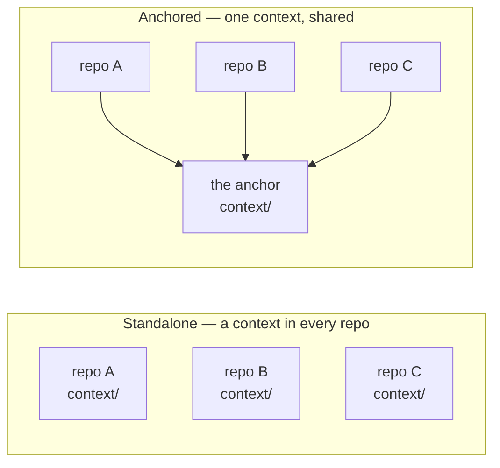

# `/setup-awow` — long-form walkthrough

This is the step-by-step reference for `/setup-awow`, awow's setup wizard: every step, what it
asks, and what it writes. ("The wizard" below always means `/setup-awow`.) For the shorter
version — what it is for and how it fits the plugin model — read [Setup & the plugin
model](guides/guide-setup-and-two-harnesses.md). The command itself is the source of truth;
this file follows it.

**Running it is optional.** Install the awow plugin and the commands already work against your
board with no setup at all — the [README](README.md) has the per-product install commands. Run
`/setup-awow` when you want more than that: the agent working from your mission, your
conventions, and your board's real state machine rather than generic defaults.

**How it runs.** The wizard is incremental and resumable. State lives in
[`setup-progress.md`](setup-progress.md) at the repo root. Re-invoking `/setup-awow` reads that
file and picks up where the last session stopped. (Those links point at awow's own progress
file, kept in this repo as a worked example of a filled-in one.) Every artefact is drafted
under `proposals/setup/<step>/` and moved to its final location only after you approve it.

**The step map is 0 to 9.** Step 0 (installer) and Step 1 (board) are the required core —
after them the repo is usable. Everything from Step 2 on is recommended rather than required,
can be done in any order, and mostly fills on first need rather than during setup. On every
invocation the wizard lays out the whole map, marked ✓ complete, ⧗ deferred or pending, or ☐
untouched, before it runs anything.

## Before the first step

Four things happen before Step 0, in this order. None of them is a numbered step. Only the
first runs on every invocation; the other three are settled once and then remembered in
[`setup-progress.md`](setup-progress.md).

### 1. Preflight — verify, change nothing

The wizard checks its prerequisites first and writes nothing while doing it — no installs, no
MCP registration, no `git init`, not even [`setup-progress.md`](setup-progress.md). It reports,
points at the fix, and gates:

| Check | If it fails |
| --- | --- |
| `git` on PATH | **Fatal.** Prints the install pointer for your platform and stops — no step map, no steps. |
| The workspace is a git repository | **Fatal.** Tells you to run `git init` yourself, and stops. It will not run it for you. |
| A board surface — an MCP server, or `gh` for GitHub boards | **Soft.** Continues, but marks board-dependent work — Step 1b's mode pick, Step 3's observe mode, every board write — as `⧗ blocked` in the step map, and steers you to the steps that don't need it. |
| `gh` auth and scopes, for GitHub-family boards only | **Soft**, handled as the row above. Pointers are `gh auth login` and `gh auth refresh -s repo,project,read:org`. Never rendered for other board tools. |
| The current harness's wiring | **Soft — and unrelated to the board.** A miss here means the commands may not reach you in this harness; it blocks no step. The fix is always a pointer, never something the wizard does for you. |
| Other declared harnesses, payload freshness | Informational only. Another harness's wiring cannot block this session. |

When everything passes you get one line above the step map: `preflight: git ✓ · repo ✓ · board
✓ · harness ✓`.

**The board check proves identity, not just presence.** A configured server with the right
name is not enough — loaded tools expose a server's name and nothing else, so the wizard makes
one identity-bearing read and requires it to return the board your recorded URL names. A
server that answers but serves a different workspace reports as `blocked`, with the reason
spelled out, rather than being silently adopted.

**What "harness wiring" means depends on the harness.** Claude Code has nothing to check — the
plugin delivered the command you are running. Copilot CLI checks that `copilot` is on PATH;
Copilot in VS Code checks for `.vscode/mcp.json` when the surface is an MCP. Visual Studio is
the involved one: it never reads the plugin store, so the wizard checks a bridge chain —
`copilot` on PATH, the awow plugin installed, and a bridge marker whose version matches the
plugin's — and every pointer names a **Copilot CLI session** as where to run the fix, because
VS has no command surface of its own. Codex, Pi and opencode have no checks defined and render
as `harness ✓ (no checks defined for <harness>)`.

### 2. Install shape — standalone or anchored

Classified once per repo, before Step 0:

- A vendored tree ([`.agents/AGENTS.md`](.agents/AGENTS.md)), or an `install-shape:` already
  recorded in [`setup-progress.md`](setup-progress.md), settles it — the wizard does not re-ask.
- A root [`AGENTS.md`](AGENTS.md) whose frontmatter carries an `anchor:` key marks the repo as
  **anchored**, and the wizard switches to the Anchored track below.
- Otherwise, on a plugin install in a repo with no awow files, it asks once whether this repo
  is joining a team that already runs awow from a shared repo. Anchored is only a valid answer
  when that anchor already exists — **"not sure" means standalone**, and you can anchor later.

#### The Anchored track

Anchoring means many repos share one team context instead of each carrying a copy.

**The anchor is an ordinary awow repo** — one that ran the full `/setup-awow` itself, so its
[`context/`](context/) is filled in. Nothing marks it as special: it becomes an anchor simply
because other repos point at it. Teams either use a repo they already have or stand up one that
exists mostly to hold the context. The one thing it gains is a register of the repos anchored to
it, in [`context/tooling/knowledge-sources.md`](context/tooling/knowledge-sources.md).

What it holds is the shared team context: board wiring, conventions, members, team profile,
knowledge base, retros. An anchored repo keeps only what is genuinely its own — what this
project is, and which of the anchor's boards it maps to — and reads the rest from the anchor.
Change a convention once, and every anchored repo picks it up.

So the Anchored track doesn't repeat the full setup; it registers the repo against its anchor.
Two things get recorded, and the split matters: **which** anchor is committed to the repo as a
git URL, while **where** that anchor sits on your machine is written to a gitignored
`.awow/anchor.json` and never committed. That is why a teammate cloning the repo answers one
prompt — the repo already knows which anchor it belongs to, so they supply only their own path.

Five steps, each following draft → approval → land:

1. **Identify the anchor** by its git remote URL, plus this repo's project name. The wizard
   never infers an anchor from sibling directories without you confirming.
2. **Resolve it locally** — an accessible checkout whose `origin` matches that remote, or a
   path you give, or a fresh clone. A checkout whose `origin` doesn't match is a stop, not a
   warning.
3. **Write the machine link** at `.awow/anchor.json`, and make sure `.gitignore` covers
   `.awow/`. This is machine-local: never committed, and the path never appears in a committed
   file.
4. **Draft the anchored-repo PR** — root [`AGENTS.md`](AGENTS.md) with connector frontmatter,
   `.claude/settings.json` enabling the plugin at project scope, `context/mission.md`,
   `context/board-scope.md` naming which of the anchor's boards this repo maps to.
5. **Draft the anchor PR** — a knowledge-source record for this repo in the anchor, plus its
   index line. If you can't open PRs against the anchor, the draft is left under
   [`proposals/`](proposals/) with a note naming who can.

Registration completes when both PRs merge; neither blocks the other. Teammates then only clone
the repo and answer the one-time map-the-anchor prompt.

### 3. Orientation — team or solo, and who answers what

The wizard asks once whether you're setting up for a team or just yourself, and records `track:
team | solo`. In **solo** mode it skips Step 4 (members — the roster is only you) and Step 7
(neighbouring teams), still drafts the style files, and reframes Step 2 as what you are
building rather than a team charter.

With `track: team` it also establishes which board or boards and which team or teams this repo
serves, inferring both when a wired surface already names exactly one team. More than one board
means Step 1b runs once per board.

A **hat** is a role — *product* or *engineering* — and the wizard uses it only to know who a
question is really for. You are never asked to pick one. Mention your role in passing at
orientation ("I'm the PO") and it infers one; say nothing and you get `hat: both`, which
answers everything with no ceremony at all. Most people never see the vocabulary.

Each step carries the hat its answers naturally come from — engineering for 0, 1a, 5 and 9;
product for 1b, 2, 3, 4, 6, 7 and 8. This is routing, not a gate: any hat may answer any step,
and the wizard never blocks on the wrong one. What it does instead is mark the result as
unconfirmed — the artefact lands with a first line `provisional: needs <hat> confirmation`, a
hand-off brief appears under `proposals/setup/`, and an entry in
[`setup-progress.md`](setup-progress.md) surfaces on every later invocation until the right
person confirms or amends it.

### 4. Choose a route — guided or workshop

Offered once, on first entry:

- **Guided** (default) — answer as you go, one step at a time. The required steps take about
  15 minutes.
- **Workshop** — the wizard drafts a 25–30 minute meeting agenda, the team talks it through in
  its own time, and the transcript or notes come back as the same setup proposals.

## The required core

### Step 0 — Installer (REQUIRED)

> **If you installed awow as a plugin, skip this step — it does not apply to you.**

That is the normal case, and it covers every install in the README. There is no `.venv/` to
build and no pointer stubs to generate: the wizard says so in one line, records
`0. Installer — n/a (plugin install)` in [`setup-progress.md`](setup-progress.md), and goes
straight to Step 1. It will never vendor awow's files into your repo, and never runs an
installer from the payload against it.

**Everything below applies to one case only: a legacy vendored tree** — a repo that copied
awow's starter files in before the plugin existed, recognisable by
[`.agents/AGENTS.md`](.agents/AGENTS.md) and [`setup/install.sh`](setup/install.sh) sitting in
it. If that is your repo, `/migrate-to-plugin` is the command that retires the vendored copies
and hands the surface back to the plugin.

1. Detect whether `.venv/` and the pointer stubs already exist. Both present: Step 0 is
   already complete.
2. Otherwise ask permission to run the platform installer —
   [`./setup/install.sh`](setup/install.sh) on macOS/Linux,
   [`.\setup\install.ps1`](setup/install.ps1) on Windows.
3. Run it, surfacing its output verbatim. The usual failure is `uv` not on PATH; the fix is to
   install `uv` and re-invoke `/setup-awow`.
4. Verify, then record Step 0 complete.

### Step 1 — Kickoff (REQUIRED)

The outcome is a wired read/write board surface **plus** a fully-populated
[`context/tooling/board.md`](context/tooling/board.md) — the team's actual board spec, not just
the MCP wiring. Every command reads that file afterwards to know what a label means, which
states are terminal, and where a new issue belongs. It runs in two parts.

#### Step 1a — Wire the read/write surface

Infers the board tool family from your board URL (Linear, Azure DevOps, Jira, GitHub Issues),
then installs or verifies the matching MCP server — or, for GitHub, offers the `gh` CLI as the
lighter alternative. If you can't finish the install in this session (a token in another
browser, an IT ticket), the surface is recorded as `pending` and Step 1b continues, so the repo
is at least partially usable.

#### Step 1b — Board configuration

Loads the reference for your tool from `context/tooling/boards/<tool>/reference/`, then counts
the closed issues on your board — 10 is the threshold — and tells you which mode it picked
before doing anything. The two modes run in opposite directions.

**Mode A — set up from the reference.** Under 10 closed issues: a new board, nothing to
preserve, so awow's defaults flow *onto* it. The wizard drafts the whole spec from the
reference, staging the changes your tool can make through the wired surface and writing you a
checklist for the ones it can't.

**Mode B — capture what is already there.** 10 or more: a board in real use, whose habits
outrank a generic default, so your board flows *into* awow. The wizard writes the live state —
statuses, labels, fields, team page — into [`board.md`](context/tooling/board.md), then lists
every difference from the reference for you to settle in one batch: close, override, or accept.
Labels that diverge (`bug` where the reference expects `type:bug`) update
[`labels.md`](context/team/conventions/REQUIRED/labels.md) too, so later proposals speak your
team's language.

In both modes it walks the reference sections in order — states, hierarchy, labels, fields, team
page, cycles or iterations — drafts the whole spec in one pass, and presents **one** review
gate: land, adjust a section, or evaluate against the live board. There are no per-section
approvals before it and no second confirmation after. Once landed it writes
[`context/tooling/board.md`](context/tooling/board.md) and checks off Step 1.

## Steps 2 to 9

**Setup ends at Step 1.** What follows is not a queue to work through:

- **Steps 2, 3, 4, 6, 7 and 8 are deferred fills.** The wizard does not walk them in order the
  way it walks Steps 0 and 1. Instead, the first command that needs one of these artefacts
  offers to draft it in the moment, from the board and repo where possible. The wizard enters
  one only when a command triggers it, when you name it, or when you resume that step
  explicitly. Each fill below says what triggers it.
- **Steps 5 and 9 you run deliberately** when you want them.

A fill that lands marks its step ✓ in [`setup-progress.md`](setup-progress.md) exactly as a
wizard walk would. The [`context/`](context/) paths below link to this repo's own copies — the
templates and stubs the wizard starts from, so you can see the shape of each file before it is
filled.

### Step 2 — Team profile (deferred fill)

Lands at [`context/team/mission.md`](context/team/mission.md). Two to five plain sentences: what
the team is building, for whom, and in which stack. A one-sentence mission is an optional first
line: the wizard keeps one if the team already has it, and never asks you to write or polish
one.

The wizard drafts from observation before asking anything — the board's project and epic names,
the repo's manifests and language mix, the adopter repo's own README — and presents one gate:
edit anything, or approve. The open question is the fallback for a bare repo and a near-empty
board.

*Triggered by: the first command that frames scope — `/refinement-prep`,
`/process-transcript`, `/solution-design-flow`.*

### Step 3 — Required conventions (deferred fill)

Lands at [`context/team/conventions/REQUIRED/`](context/team/conventions/REQUIRED/) —
[`issue-titles.md`](context/team/conventions/REQUIRED/issue-titles.md),
[`labels.md`](context/team/conventions/REQUIRED/labels.md),
[`branches.md`](context/team/conventions/REQUIRED/branches.md),
[`output-discipline.md`](context/team/conventions/REQUIRED/output-discipline.md).

With 10 or more closed issues the wizard **observes**: it queries the board, summarises the
existing pattern, and shows you three real examples to confirm. Greenfield boards are
**guided** through sensible defaults from the reference, and you can opt out of any rule that
doesn't fit.

[`output-discipline.md`](context/team/conventions/REQUIRED/output-discipline.md) is
non-negotiable — without it the agent over-produces from session one. You can iterate on the
rules; the file itself isn't skippable. The optional conventions
([`infra-naming.md`](context/team/conventions/OPTIONAL/infra-naming.md),
[`data-objects.md`](context/team/conventions/OPTIONAL/data-objects.md),
[`code-style.md`](context/team/conventions/OPTIONAL/code-style.md)) stay as `# OPTIONAL — defer`
stubs and are never asked about during setup.

*Triggered by: the first board write.*

### Step 4 — Members and style (deferred fill)

Lands at [`context/team/members.md`](context/team/members.md) and
[`context/team/style/*.md`](context/team/style/).

If the board has a team page, the roster comes from there for confirmation rather than being
asked for cold. The style files — board output, comments, placement, prose — are drafted from
the reference templates and customised only where you push back.

*Triggered by: the first artefact needing the roster or the team's voice — speaker mapping in
`/process-transcript`, any style-bearing output.*

### Step 5 — `CLAUDE.md` / `AGENTS.md` bootstrap

Runs [`tools/bootstrap-claude-md.py`](tools/bootstrap-claude-md.py), which reads the stub at
[`.agents/AGENTS.md`](.agents/AGENTS.md) plus everything the wizard has produced so far and
writes a team-specific instruction file.

You are asked to populate the `## Do not propose` block — explicit scope-shedding ("we are not
adding multi-user this quarter"), which stops the agent from helpfully reintroducing scope at
session start.

In a vendored install, [`tools/gather.py`](tools/gather.py) then mirrors the result to
[`.claude/CLAUDE.md`](.claude/CLAUDE.md) and [`.github/AGENTS.md`](.github/AGENTS.md). **A
plugin install has nothing to mirror** — the landed file is the team's own.

### Step 6 — Knowledge base seed (deferred fill)

Populates [`context/knowledge-base/README.md`](context/knowledge-base/README.md) and seeds
[`glossary.md`](context/knowledge-base/glossary.md) from any glossary you already have. The
wizard also explains the capture → synthesize spine, so the KB isn't a folder nobody fills:
`/kb-mine` stages candidates as files in [`context/kb-inbox/`](context/kb-inbox/), and
`/kb-synthesize` turns them into durable entries.

*Triggered by: the first `/kb-mine` or `/kb-synthesize` run.*

### Step 7 — Neighbouring teams (deferred fill)

Lands at [`context/company/neighbouring-teams.md`](context/company/neighbouring-teams.md).
**Nothing is scaffolded up front and no stub files are generated.** The boundary is recorded on
first contact — the first cross-team boundary a transcript or design touches offers to record
just the team it named. Each neighbouring team still writes its own summary; ours records the
boundary. Use this step directly only to bulk-record several teams at once.

*Triggered by: the first cross-team boundary in `/process-transcript` or
`/solution-design-flow`.*

### Step 8 — Surface the extras (deferred fill)

Lists the commands whose frontmatter declares `phase: spread` or `phase: standardise`, with
each one's prerequisites and the pain it removes. They all ship in the payload already — the
phase says when a team is ready for one, not whether it is installed.

Three opt-ins are offered here, each detect-then-suggest:

- **Design system.** If [`context/tooling/design-system.md`](context/tooling/design-system.md)
  is `mode: absent`, one question: does your team produce styled HTML artifacts? If yes, the
  pointer is `/design-system` — the wizard does not run it for you.
- **Session-board correlation.** Links agent-authored board entries back to their session
  traces. Requires tracing to be wired already; the wizard checks, and stops with a pointer if it
  isn't. It does not set tracing up.
- **Build engine.** awow owns the outer loop and hands the build step to an optional
  inner-loop engine. If one is installed it's named and the seam is already active; if not, it's
  recommended as genuinely optional — awow runs on its baseline build guidance without one.

*Triggered by: the extras themselves — each detects its own situation and suggests itself.
Walk this step directly only on request.*

### Step 9 — Skills review (keep / customise / drop)

The starter pack ships several skills, each opinionated about some part of the stack — the
harness session format, the tracing backend, the story rubric — so none of them fit every team
out of the box.

The wizard presents **one table** covering every shipped skill: a one-line summary, the
specific assumption it bakes in (quoted from the skill's own "Starter shape — adjust for …"
callout), and what depends on it. The default is **keep all**; you name exceptions only. It
does not ask per skill.

Customisations are drafted under `proposals/setup/` before landing. Dropped skills are removed
and noted in [`setup-progress.md`](setup-progress.md), so a re-run doesn't keep re-offering
them.

Five of these skills — `mlflow-export`, `prompt-skill-analysis`, `awow-usage-coach`,
`project-timeline`, `session-export` — ship in the separate `awow-telemetry` plugin. If you
haven't installed it, the wizard says so once and moves on rather than offering to customise
skills that aren't there.

**Re-run this step whenever the stack changes** — new harness, new tracing backend, new shared
rubric. Skills review is not a one-shot.

## Quickest-quickstart

`/setup-awow --quickstart` does Steps 0 → 1 → 2 → 3 → 5 in one turn, with sensible defaults for
everything not asked about, skipping the per-step review loop. Step 0 still asks permission
before running any installer, on the vendored path where it applies.

Lower activation energy, for people who already know what they want. The conversational wizard
remains the default and the recommended path for teams new to the model.

## Proposal-first

Every artefact the wizard would write lands first as a draft under `proposals/setup/`. You
review, then the wizard moves it to its final location. Iterate on cheap-to-change artefacts;
land the work only once the proposal is right. The wizard does not bypass this.
