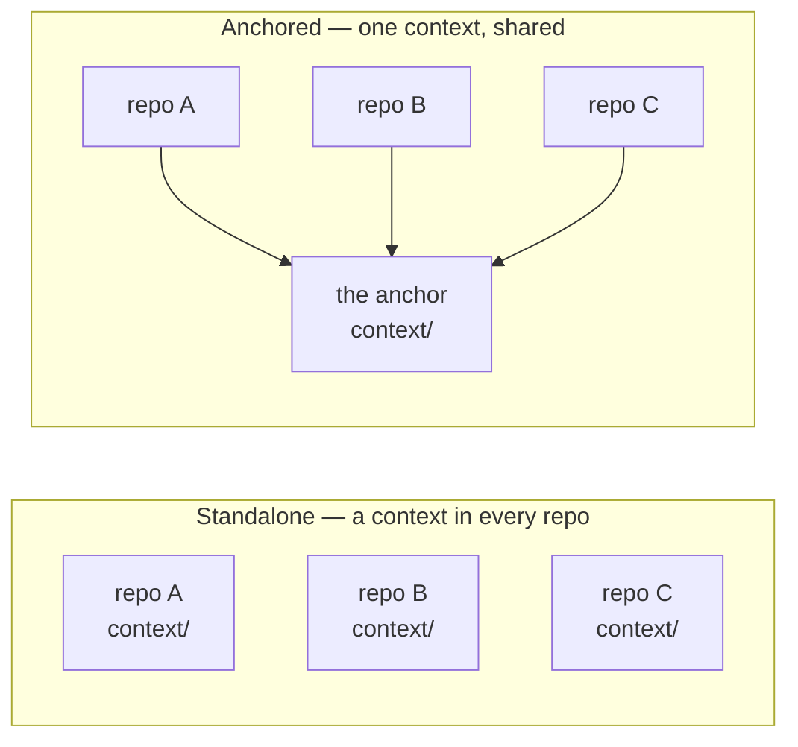

# `/setup-awow` — what it does, what it asks, what it writes

`/setup-awow` configures a repo for awow: it connects the board, or anchors the repo to a team's
shared repo, and stops. It is one command, not a wizard. It inspects what exists, asks only for
what is missing, shows one configuration diff, and applies it on your approval. The command
itself ([`.agents/commands/setup-awow.md`](.agents/commands/setup-awow.md)) is the source of
truth; this page follows it.

**Running it is optional.** Install the plugin and the commands already work against your board
with no setup at all — the [README](README.md) has the per-product install commands. Run
`/setup-awow` when you want the agent working from your board's real state machine and your
conventions rather than generic defaults, or to anchor a repo to a team's shared context.

```
/setup-awow [<board-url>] [--anchor <git-url>] [--check]
```

| Argument | Meaning |
| --- | --- |
| `<board-url>` | The board this repo works against. Needed only when nothing in the repo names one. |
| `--anchor <git-url>` | The shared repo (the **anchor**) whose context this repo reuses. The URL is committed; where it is checked out on your machine never is. |
| `--check` | Report the repo's awow state and change nothing. Safe anywhere, any time. |

There are no other flags: no `--yes`, no `--quickstart`, no `--root`.

## Every run

1. **Inspect, read-only.** Git, the root `AGENTS.md` and its frontmatter, `context/tooling/board.md`,
   the conventions and the team profile, the anchor link, the board-surface candidates and one
   identity-bearing read against the board. Write access is settled without writing: `verified`
   by a permission read, `unverified` when no read can prove it, or `denied`. Setup never writes
   to a board to find out.
2. **Preflight.** `git` on PATH and a git repository are fatal misses (a pointer, then stop). A
   missing or wrong-workspace board surface is a repair line in a configured repo. When setting a
   repo up, a board setup cannot read ends the run at the install pointer: install or authenticate
   it, then re-run. Setup never drafts `board.md` without reading the board.
3. **Name the situation** — one of the five below — in one plain sentence: what was found, what is
   missing.
4. **Ask only for what is missing.** The only questions the command ever asks are listed per
   situation. It never asks whether the setup is for a team or one person, your role, a mission
   sentence, the member roster, a vision, which harnesses the team uses, or which skills to keep.
5. **One diff, one gate.** Every file, one line each — path, new or changed or local-only, effect,
   and for a convention whether it was observed on the board or is a reference default. Reply `go`,
   `strike <n>`, `show <n>` for a file's exact content, or `cancel`. Setup lands exactly what the
   approved lines say; anything extra is a new line to approve first. Nothing is written before you approve, and nothing is
   ever written to the board.
6. **Apply, then hand over** to a real command: `/process-workitem` on a board item, `/my-work`
   for what is waiting on you.

## The five situations

| Situation | When | It asks for | It writes |
| --- | --- | --- | --- |
| **Init a repo** | No awow context here and no `--anchor` | The board URL, unless given or derivable from an already-wired surface | `context/tooling/board.md` observed from the live board; the four conventions under `context/team/conventions/REQUIRED/` as proposals; `context/team/mission.md` only when the repo and board make a profile observable; a short pointer appended to the root `AGENTS.md` |
| **Share an anchor** | A configured repo whose context other repos should reuse | Nothing | Nothing. Any awow repo is an anchor: teammates run `/setup-awow --anchor <this repo's origin URL>` in their repos. No conversion, no other kind of repo. |
| **Connect a repo** | `--anchor <url>` in a repo without its own context | Where the anchor is checked out on this machine, when it cannot be verified; which of the anchor's boards, only when it lists several | Root `AGENTS.md` frontmatter (`awow: anchored`, `anchor:`, `project:`), the gitignored `.awow/anchor.json`, `context/board-scope.md` for a multi-board anchor, and a knowledge-source record for this repo in the anchor — landed there when you have push rights, kept as a ready-to-apply draft when you do not. The board is the anchor's; no board spec is written here. |
| **Join the team** | The repo is configured but this machine lacks the board surface or the anchor checkout | The checkout path | Only `.awow/anchor.json`. The board's install snippet is printed for you to run. Nothing committed changes. |
| **Use or repair** | Everything is present | Nothing | A repair per finding — a pointer for a surface that is not loaded, a re-mapped anchor link, an offered convention draft — or `nothing to repair`. |

**What init observes.** States, labels in use, hierarchy and containers, native fields, cycles and
the team page, through the wired surface, written under the same headings the board reference
uses. Where the surface cannot answer, the section reads `unknown — not observable`. Setup never
creates a label, a state or a field: configuring the board itself stays a human action in the
board's UI. Conventions come from the observed pattern with three real examples, or from the
reference defaults on a new board; either way they are proposals you can strike.

**The pointer.** Six lines at most, under a `## awow` heading, appended to an existing
`AGENTS.md` without rewriting, reordering or trimming what is there — or a new file when none
exists. Your `CLAUDE.md` is never touched.

**The profile is optional.** Setup drafts `context/team/mission.md` only from what the README,
manifests and board make observable. When nothing supports one it says so and moves on. No
command interviews for it later either: the first command that needs it offers to draft it, and
proceeds without it when declined.

## Anchoring

Anchoring means many repos share one team context instead of each carrying a copy.



The anchor is an ordinary awow repo whose `context/tooling/board.md` and conventions are
committed. Nothing marks it as special: it becomes an anchor because other repos point at it.
Two things get recorded when a repo connects, and the split matters: **which** anchor is
committed in the repo's `AGENTS.md` as a git URL, and **where** it sits on your machine goes to
the gitignored `.awow/anchor.json`. That is why a teammate cloning the repo answers one prompt —
the repo already knows which anchor it belongs to; they supply only their own path.

## Undoing setup

Everything `/setup-awow` writes is a plain file, and all but one are in git: `context/tooling/board.md`,
the conventions under `context/team/conventions/REQUIRED/`, `context/team/mission.md` when it could
be observed, a `## awow` section in the root `AGENTS.md`, and the plugin entry in `.claude/settings.json`.
The one file outside git is the local `.awow/` folder. To take a repo back to how it was:

```bash
git checkout -- context/ AGENTS.md .claude/settings.json   # or simply do not commit
rm -rf .awow/
```

There is no reset command, on purpose: deleting a team's context is the one destructive act awow
never performs by itself.

## What moved out of setup

The team conversation about mission, work flow, rituals and ownership is `/team-workshop` in the
optional `awow-workflows` plugin: it prepares a 25–30 minute meeting brief and turns the
transcript into context proposals through the same kind of gate. Members and style, the
knowledge base, neighbouring teams, the design system, session correlation and the build engine
each fill or offer themselves from the command that first needs them. There is no skills review:
customise a skill by keeping a repo-local copy, which outranks the plugin's.
