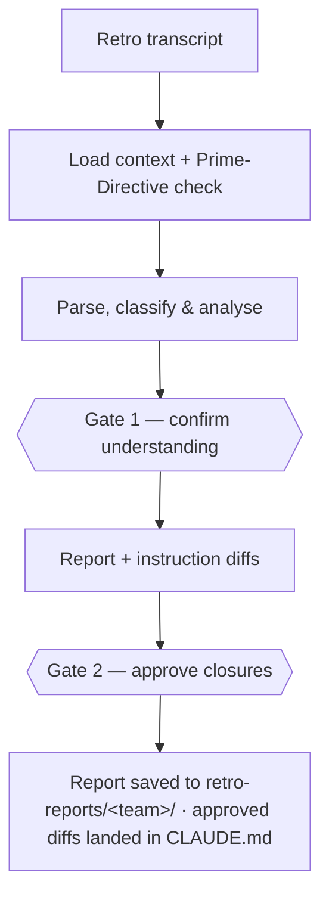

# The agentic retro workflow

How a retrospective transcript becomes named anti-patterns, owned actions, and concrete diffs back into your agent's instructions.

> **TL;DR** — Point `/process-retro` at a retro transcript. It parses, classifies, and probes for
> anti-patterns against a maintained library, every finding carrying a verbatim
> `[hh:mm:ss] @Speaker` quote. It stops twice: Gate 1 to confirm it understood the session, Gate 2
> to approve what gets written. The artefact is not the retro notes — it is the
> instruction-tightening: concrete diffs to `CLAUDE.md` that the *next* retro checks for.

## The pipeline

The agent works as a **sparring partner, not a secretary** — it shows its reasoning so you can
correct it.



## Why it exists

Retros generate good intentions that evaporate — action items lost in a doc, or vague tickets
nobody pulls. Here a recurring problem becomes a concrete diff to the agent's instructions, and the
*following* retro verifies whether it stuck. That is what makes a retro a learning loop instead of
a venting ritual.

## What it reads first

Whatever team context is available; it does not gate on context.

| Source | What it unlocks |
| --- | --- |
| `context/retros/canon.md` | The load-bearing grounding: Prime Directive, the five-phase model, format taxonomy, what "good" looks like. |
| `context/retros/anti-patterns.md` | The maintained library of named issues to probe for. |
| `context/team/members.md` | Speaker attribution and the sentiment pass. |
| `context/tooling/board.md` | Verifying whether last retro's promises actually landed. |
| `retro-reports/<team>/` | Prior reports — the input for trajectory analysis. |

It also runs a **Prime-Directive check**: scanning the opening minutes for Norm Kerth's blameless
framing — read aloud, paraphrased, or absent — and recording which. Absence is not punishable, but
it is observable.

## 1 · Parse, classify & analyse

The agent parses WebVTT, plain text, or SRT, re-attributes shared-microphone speech where it can,
then does the analytical work:

- **Detects the format actually run** — open discussion, silent generation, 1-2-4-All, Lean
  Coffee, TRIZ, futurespective — or flags *conversational dominance*, which is a pathology, not a
  chosen format.
- **Filters noise** with a discard taxonomy (greetings, demo mechanics, drift). A high discard
  fraction is itself a signal.
- **Probes for anti-patterns** — `venting-ritual`, `action-orphan`, `duplicate-creation`,
  `attribution-gap`, `prompt-drift`, `board-zombie` and the rest — kept in two sections so you can
  see what has prior literature behind it and what is agentic-AI-specific and net-new.

Where history exists it adds a **sentiment & safety pass** (talk-time share, cut-offs, hedges,
energy) and **trajectory analysis**, classifying each issue as recurring, new, or resolved.

**Gate 1 — confirm understanding.** It presents detected format, participants, anti-patterns
found, recurring issues, sentiment notes, and anything it is unsure about, then waits. Fix an
attribution or add a missed topic here, before it drafts.

## 2 · Report & instruction diffs

Every claim cites `[hh:mm:ss] @Speaker`; with no signal it says so rather than padding. Three
bands:

| Band | What's in it |
| --- | --- |
| **Core** — every retro | Header & format · sentiment & safety snapshot · what worked / what didn't · detected anti-patterns (general vs agentic-AI) · action list (severity × scope, every action owned). |
| **Trajectory & closure** — when history exists | Cost & velocity · trajectory vs last retro · counter-signal (what was conspicuously absent) · closure tracker against the board. |
| **Loop & audiences** | Instruction-tightening diffs · three role-conditioned summaries · next-retro format recommendation. |

**Gate 2 — approve closures.** It presents the instruction diffs (these change agent behaviour —
review them carefully), the sponsor one-pager, and any `@unassigned` actions. Only what you
approve gets written, and diffs land in `CLAUDE.md` with a provenance comment.

## Closing the loop into the instructions

**Actual diffs, not vague suggestions** — concrete lines for `CLAUDE.md`,
`copilot-instructions.md`, or a specific prompt, each with its reason:

```markdown
# Add to CLAUDE.md § board interaction

When creating a board item, first search for an existing one that
covers the scope; link it instead of creating a duplicate.

# Reason: duplicate-creation anti-pattern, 3 instances this retro.
```

Because the diffs land in version control, the next retro's closure tracker can check whether they
prevented their target anti-pattern. Recurring nuisances get promoted to blockers automatically —
"this is the 3rd retro flagging X" is the highest-value line in the whole report — and issues
quiet for two retros get celebrated as resolved.

## Three audiences, one retro

Three deliberately distinct summaries, not the same content reordered, each on its own cadence:

| Summary | Shape | Cadence |
| --- | --- | --- |
| **Team-local checklist** | ~10 lines, tactical, for the team going into next retro | next standup |
| **Governance digest** | ~½ page of patterns, risks, and trajectory, manager-level | monthly |
| **Sponsor one-pager** | ~½ page of value, cost, top risks, and the ask | quarterly |

A **solo mode** also exists: point it at a voice memo and it skips the sentiment pass and collapses
the summaries, but keeps anti-pattern detection on.

## Sources of truth

- [`.agents/commands/process-retro.md`](../.agents/commands/process-retro.md) — the pipeline, the two gates, and the report structure
- [`context/retros/canon.md`](../context/retros/canon.md) — the Prime Directive, phase model, and format taxonomy the analysis grounds on
- [`context/retros/anti-patterns.md`](../context/retros/anti-patterns.md) — the library probed against; extend it as the team names new ones
- [`.agents/commands/process-transcript.md`](../.agents/commands/process-transcript.md) — the general-meeting sibling that routes here
- Companion guides: [transcript router](guide-transcript-router.md) — how a transcript reaches this command; [core delivery loop](guide-core-delivery-loop.md) — how the actions a retro surfaces move from board to merged
