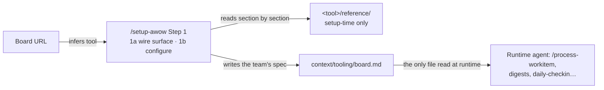

# Board & MCP integration

How a board URL becomes one configured file the agent reads — and how an approved MCP gets wired into both harnesses.

> **TL;DR** — Give `/setup-awow` Step 1 a board URL. It wires a read/write surface (an MCP, or
> the `gh` CLI for GitHub), then walks the per-tool `reference/` files one section at a time and
> writes the team's real spec into `context/tooling/board.md` — thereafter the only board file
> the agent reads. MCP servers are governed separately: a server clears an intake, joins
> `mcps/catalogue.md`, then gets wired into `.mcp.json` (Claude Code) and `.vscode/mcp.json`
> (Copilot).

## The single source of truth

Two kinds of board knowledge, read at two different times by two different actors.

| | Read by | What it is |
| --- | --- | --- |
| `<tool>/reference/` under `context/tooling/boards/` | The wizard, at setup time only | Best-practice templates per board tool. `/setup-awow` Step 1 reads them section by section to drive the configuration conversation. **Never consulted at runtime.** |
| `context/tooling/board.md` | The runtime agent | The team's actual board spec, composed from the reference plus the team's choices. The **one file** the agent reads when it needs to act on the board. |

The split means the references can grow in depth over releases without changing anything the
agent reads day to day.

## From URL to the file the agent reads



## Supported boards (v0.1)

One subfolder per tool under `context/tooling/boards/`. Depth varies; all share the same
`reference/` layout so the wizard treats them uniformly.

| Folder | Board tool | Depth |
| --- | --- | --- |
| `linear/` | Linear | Full reference. Takes a team greenfield-to-running without leaving the wizard. The worked example other tools match. |
| `azure-devops/` | Azure DevOps | Full reference; some sections marked TODO for v0.2. |
| `jira/` | Jira | Skeleton. Mode B (assess current) is the expected path; v0.2 fills in Mode A. |
| `github-issues/` | GitHub Issues + Projects v2 | Skeleton, plus a `gh` CLI alternative to the MCP. |

Step 1 infers the tool family from the board URL hostname — `linear.app`,
`dev.azure.com`/`*.visualstudio.com`, `*.atlassian.net`, `github.com/.../issues`. Anything else
is unsupported and the wizard stops.

## What the wizard reads, and what it writes

**Read — per-tool `reference/`.** Same shape for every tool; one file per concern, so the team
can adjust or evaluate each independently at the review gate.

- `states.md` — five-state contract → the tool's workflow states
- `hierarchy.md` — L1–L4 mapping to the tool's primitives
- `labels.md` — `type:` / `area:` / `status:` taxonomy
- `fields.md` — priority, estimate, iteration, assignee
- `duplicates.md` — dedup features + search-before-create recipe
- `team-page.md` — team page / project description conventions
- `mcp.md` — surface install for both harnesses + verify checklist
- `cycles.md` / `iterations.md` — only if the tool has the concept

**Write — `board.md` headings.** Both modes produce the same artefact shape, so the agent never
needs to know which mode produced it: Tool & wiring (family, URL, MCP/CLI surface, verify
status) · State machine · Hierarchy · Label taxonomy · Required fields · Avoiding duplicates
(dedup limits + the team's recipe) · Team page conventions · Cycles / iterations · Divergence
from reference (populated by Mode B, empty for Mode A).

## Mode A vs. Mode B

Step 1b picks a mode automatically by counting closed (or `Done`) issues. The threshold is **10**.

| Mode | Trigger | Behaviour |
| --- | --- | --- |
| **A — set up from reference** | <10 closed issues (greenfield or under-configured) | Drafts the full spec from the reference in one pass, presents one review gate (*land / adjust / evaluate*), applies choices via the surface where it can mutate config. Where it cannot (Linear Free workflow states, ADO process templates, Jira workflows) it emits a manual checklist and re-verifies after the user confirms. `Divergence from reference` stays empty. |
| **B — assess & capture current** | ≥10 closed issues (established board) | Pulls the actual state machine, hierarchy, labels, and fields from the surface into `board.md`, then diffs the capture against the reference and surfaces gaps — not to force adoption, but so the team can close, override, or accept each. Resolutions land in `Divergence from reference`. |

## The override model — two layers

The reference is a starting point, not a mandate. It is overridable at two layers, applied in
precedence order; the wizard always says which layer it read from for each section.

| Layer | Lives in | Behaviour |
| --- | --- | --- |
| **1. Enterprise override** (per file) | `.agents-overrides/tooling/boards/<tool>/reference/` | A parent org ships its own board standards next to the adopter's `.agents/`. Files here **supersede** the starter pack's reference of the same name, and the wizard announces it. |
| **2. Team override** (in `board.md`) | `context/tooling/board.md` itself | The team's review-gate decisions land inline (Mode A) or in `Divergence from reference` (Mode B). **There is no separate team-level override file.** |

## The `gh` CLI alternative (GitHub only)

For GitHub-hosted boards the surface need not be an MCP. If `gh` is installed and authenticated
for the org, the agent shells out to it through the harness's Bash tool — lighter, with no extra
PAT to manage. The wizard offers it whenever a user hits friction at the MCP install step.

```bash
# reuse existing gh auth; grant the scopes the operating model needs
gh auth status
gh auth refresh -s repo,project,read:org
```

`repo` covers Issues + PRs, `project` covers Projects v2, `read:org` covers team membership. The
choice is recorded as `surface: gh-cli` in `board.md`; downstream commands check that field and
use `gh` calls instead of MCP tool invocations. Trade-off: each call is a subprocess (slower),
and there is no streaming or push — strictly request/response.

## The MCP catalogue & intake

Boards are one kind of MCP; any server an agent talks to is governed the same way. The approved
list lives in `mcps/catalogue.md`, and a server only joins it after clearing an intake
assessment (answers in `mcps/intake/<MCP-name>.md`):

- **Author and publisher** — who built it?
- **Exposed tools** — what does it expose to the agent?
- **Tool behaviour** — read or write? Side effects?
- **Blast radius** — worst case if the agent called every tool with adversarial inputs?
- **Data flow** — personal data? Credentials? Does anything leave the org boundary?
- **Security precautions** — auth, access control, rate limiting, logging?

A reviewer (security lead + architect) approves or rejects. Only approved servers reach
`catalogue.md`; only then does an adopter wire one in.

## Wiring an approved MCP into both harnesses

Same logical server, two config files with different shapes. Each catalogue entry should record
the rendered snippet for both.

| Harness | File | Key | Secrets |
| --- | --- | --- | --- |
| Claude Code | `.mcp.json` (repo root) | `mcpServers` | `${VAR}` / `${VAR:-default}` from shell env |
| GitHub Copilot (VS Code) | `.vscode/mcp.json` | `servers` + `inputs` | `${input:id}` — VS Code prompts once, stores in the OS keychain |

```json
// .mcp.json — Claude Code (repo root)
{
  "mcpServers": {
    "linear": {
      "type": "http",
      "url": "https://mcp.linear.app/sse",
      "headers": { "Authorization": "Bearer ${LINEAR_TOKEN}" }
    }
  }
}
```

**Gotchas adopters hit.** Unset env vars are fatal — Claude Code refuses to parse `.mcp.json` if
a `${VAR}` has no value and no `:-default`. The approval prompt is per-user (re-prompt with
`claude mcp reset-project-choices`, or VS Code's "MCP: Reset Trusted Servers").
`${CLAUDE_PROJECT_DIR}` is server-side only — use `${CLAUDE_PROJECT_DIR:-.}` in `command`/`args`.
Copilot fires MCP tools only in Agent mode, not inline or Ask.

## Install & verify shape

Every `reference/mcp.md` has the same structure so the wizard knows where to look: a **Source
docs** reference (authoritative — the in-repo snippet is a summary and may have drifted),
**Install — Claude Code**, **Install — Copilot**, and **Verify**. The verify step is
non-negotiable:

1. **Read access** — one call (e.g. `list_issues`, or `gh repo view`).
2. **Write access** — a *no-op* write on a scratch issue (re-set an existing label or its current
   description). Read-only is a blocker: the agent cannot do its job without write.
3. **Record the verification status** in `context/tooling/board.md` (`Tool & wiring`).

If the install cannot be completed in-session (token in another browser, IT ticket), the surface
is recorded as `pending` and the wizard continues with Step 1b so the repo is at least partially
usable; write-dependent items are marked `pending-write`.

## Sources of truth

- [`context/tooling/boards/README.md`](../context/tooling/boards/README.md) — board references and the two modes
- [`mcps/README.md`](../mcps/README.md) — catalogue, intake, harness wiring
- [`.agents/commands/setup-awow.md`](../.agents/commands/setup-awow.md) — Step 1, the kickoff flow
- `context/tooling/board.md` — the board surface every command reads and writes through; written by Step 1, not present until setup runs
- Companion guides: [setup & the plugin model](guide-setup-and-two-harnesses.md) — the wizard this is Step 1 of, and authoring once for both harnesses
