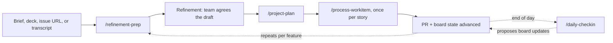

# The core delivery loop

The loop one person runs, day to day, that proves awow earns its place.

> **TL;DR** — Two Seed commands run again and again through the day: `/refinement-prep` drafts
> a right-sized feature the team reviews ahead of a session, `/process-workitem` walks one
> story from board to PR through a seven-step frame that iterates on a *plan*, never on
> production code. The Standardise companion `/daily-checkin` caps the day by reconciling what
> happened against the board. One spine throughout: board look-first, never duplicate, draft to
> markdown under `proposals/`, land only after a human approves.

## The loop

Inputs are optional: the brief can be a paragraph, a deck, an issue URL, or
`/process-transcript` output; the check-in works from board and code activity alone when
there is no written account. `/project-plan` is the bridge once refinement yields several
dependent stories — for a single throwaway story, go straight to `/process-workitem`.

## The day-to-day commands at a glance

| Command | Stage | What it produces | The gate |
| --- | --- | --- | --- |
| `/refinement-prep` | seed | A reviewed feature draft — right-sized stories — at `proposals/refinement/<slug>.md`, ready for the live session. | Duplicate check *before* drafting; co-author until the owner would put their name on it. |
| `/process-workitem` | seed | An approved plan at `proposals/<id>.md`, then the change applied, verified, and opened as a PR linked to the story. | Plan approved before any code is touched; check-in before each irreversible step. |
| `/daily-checkin` | standardise | A short daily summary plus proposed board updates — mostly comments and moves, rarely a new issue. | Read-only synthesis until an explicit "execute these updates?" approval. |

## `/refinement-prep` — draft a feature before refinement

Arrive at refinement with a draft in hand, so the session is *design discussion* rather than
*discovery*.

**Input:** a one-paragraph brief (typed or dropped in `input/`), a slidedeck or document in
`input/quarterly/`, a board issue URL to expand into stories, or `/process-transcript` output.

**What it does, in order:**

1. **Load context.** Mission (the feature must serve it — if it can't see how, it asks before
   drafting), the REQUIRED conventions, board-output style, glossary, existing patterns, and
   the board's sizing rules.
2. **Check for duplicates — before drafting.** Searches the board on keywords from the brief
   for overlapping stories, a parent feature to attach to, and related work that should shape
   scope. On a hit it stops, reports IDs and titles, and asks whether to proceed, link/extend,
   or cancel. It will not draft over an unconfirmed duplicate.
3. **Draft to markdown.** `proposals/refinement/<feature-slug>.md` — a feature wrapper plus
   three to seven stories, dependencies, open questions, and risks.

**The right-sizing rule.** Every story must be shippable by a single session as a working PR:
touches 1–5 files, describable in 2–3 sentences without hand-waving, leaves no architectural
decisions to the agent (the story says *what*; the codebase says *how*), and carries 5 or
fewer acceptance criteria. Anything that fails gets split — a "kitchen-sink" story
("implement X, add tests, update docs, refactor Y") always does.

Design decisions the team hasn't made become *open questions*, not story bodies. The command
co-authors, it never ghost-writes.

### Refinement decides the *how*, and it has more than one route

Refinement never decides *what* to build or *why*. That is set upstream in quarter planning:
the program board and PO define the outcomes (OKRs), the PO breaks each outcome into epics,
and the PO with the tech lead breaks an epic into the features that enter refinement. If a
feature's *what* is still open, that is a planning gap to close upstream — not something
refinement should paper over by inventing stories.

| Route | When you take it |
| --- | --- |
| **Feature-level refinement** | A feature becomes 3–7 stories, reviewed in a session. The default — what `/refinement-prep` produces. |
| **User-story refinement** | A smaller team skips the feature wrapper and refines stories directly from a thin brief. |
| **Continuous / BAU / operations** | No session — a PO or analyst spins up individual stories as operational work arrives. Same right-sizing and duplicate rules; there is just no feature to wrap. |
| **Solution design** | The feature carries a real architectural decision: refine it through `/solution-design-flow`, which locks the design and decomposes it into a work-item tree with stated edges. |

How outcome → epic → feature → story map onto your board's primitives — and the fact that
"epic" sits at a different level on each board — lives in
[Board & MCP integration](guide-board-and-mcp.md).

## `/process-workitem` — take a work item from refinement to PR

A generic seven-step frame, the same for every kind of work. Work-specific rules live in
archetype handlers under `.agents/commands/_workitem-archetypes/` — `feature`, `bugfix`,
`refactor`, `doc`, and any others a team registers.

| Step | What happens |
| --- | --- |
| **1 · Load** | Resolve the story from the board (or local cache) and read it through the user-story template — title, body, tags, acceptance criteria, scope boundary. If it doesn't fit the template, *stop* and repair the story; don't infer scope. |
| **2 · Classify / route** | Match the story to an archetype handler. Empty directory: run generically and suggest scaffolding a handler (stub under `proposals/archetypes/`) — don't block. Handlers exist but none match: the story is too broad (split it) or needs a new handler (ask). |
| **3 · Validate inputs** | Run the archetype's checks *before* planning. Working from assumed state is the most common cause of agent-driven bugs. If anything blocks, stop. |
| **4 · Plan** | Draft `proposals/<work-item-id>.md` — story anchor, file-by-file changes, risks, verification. **Get approval before touching code.** Iterate here, in the cheap artefact. |
| **5 · Apply** | Execute the approved plan without drifting. If scope needs to grow, raise it and amend the plan first. Respect output-placement rules — a story can't absorb knowledge-base content. |
| **6 · Verify** | Run the archetype's checks: tests / build / lint pass, each acceptance criterion has evidence, behaviour changes get a smoke check. If anything is red, stop and report. |
| **7 · Report** | Open the PR linked to the work item, summarise changes and verification, advance the board state, surface manual follow-ups. |

Three principles hold it together:

- **Iterate on the plan.** The plan is cheap to change; the codebase is not. All back-and-forth
  happens in `proposals/<id>.md` before a line of production code is written.
- **Validate before acting.** Never act on un-validated assumptions about state. Check inputs
  first; check in before each irreversible step.
- **Stay in scope.** The story defines the boundary. Related work becomes separate proposals.
  Observability, refactors, and docs are follow-up stories.

## `/daily-checkin` — the daily companion

Captures an individual's working day, maps it onto the board, cross-references it against code
activity, and proposes updates. Elastic: a detailed account yields a rich summary, a couple of
lines yields a lighter one, and nothing at all still works because board and code activity carry
most of the signal.

**It is built to bias against noise.** The default is to advance work that is already tracked
(comment on or move an existing issue); creating a new issue is the exception that must justify
itself. If the proposed list has more new issues than updates, re-map.

How it reads the day:

- **Up to three input sources, none mandatory:** the user's own account (written note, voice
  memo, or none), code activity (automatic — today's commits, PRs, reviews), and meeting
  transcripts (routed through `/process-transcript`, never parsed inline). On conflict,
  processed transcript beats verifiable code activity beats the user's account.
- **Written input is taken at face value.** Voice-to-text is treated as unreliable and runs a
  disambiguation protocol — every proper noun cross-referenced against known people, projects,
  and repos, with all ambiguous terms confirmed *before* the summary is produced. No silent
  guessing.
- **Read-only until the gate.** Nothing is created, moved, or commented on until the user
  explicitly answers "execute these updates?" — then each match is re-verified before it's
  touched.

Output is deliberately short: a 2–4 sentence summary, one line per concrete thing that moved
(tied to its board issue and commit/PR on the *same* line), a clearly-marked *not yet executed*
list, and genuine gaps only — "no gaps today" is a fine and common outcome.

## Where this loop plugs into design and coordination

When the work is larger than a single story, two further commands bracket the loop. All of it
turns on one shared artefact: a **stated dependency graph**, without which coordination has
nothing to read.

| Command | Stage | What it adds |
| --- | --- | --- |
| `/solution-design-flow` | spread | Turns a design conversation (live or a transcript) into a locked design plus a decomposed work-item tree with stated edges — each child names what blocks it. It lands the design; it does not create the board items. |
| `/project-plan` | spread | The bridge. Takes that tree and states the dependency graph — nodes, edges, sequence vs parallel layers, critical path — translates it into board items created in order with blocked-by links, and publishes a durable plan at `proposals/plans/<slug>.md`. |
| `/process-workitem` | seed | The same seven-step loop, now checking the graph before starting; it won't silently begin an item whose blockers are still open. |

`/refinement-prep` seeds the graph earlier still: it already captures dependencies as edges, so
they feed forward.

## The spine that runs through all three

| Rule | What it means in the loop |
| --- | --- |
| **Board look-first** | Before starting anything with a discernible outcome, search the board for an existing ticket. `/refinement-prep` does it before drafting; `/daily-checkin` before proposing; `/process-workitem` starts from a ticket that already exists. |
| **Never duplicate** | If a ticket already covers the scope, use it. Duplicate detection is an explicit, blocking step in `/refinement-prep` and the anti-reflex at the heart of `/daily-checkin`. |
| **Proposal-first** | Draft to markdown under `proposals/` first; the board, the knowledge base, and production code land only after a human approves. Iterate on the cheap artefact, never the expensive one. |
| **Output discipline** | Minimum-useful text; intent → story body, status → comment, durable rationale → knowledge base. A story never absorbs content that belongs elsewhere. |

## Sources of truth

- [`.agents/commands/refinement-prep.md`](../.agents/commands/refinement-prep.md) — the drafting flow and right-sizing rules
- [`.agents/commands/process-workitem.md`](../.agents/commands/process-workitem.md) — the seven-step frame
- [`.agents/commands/daily-checkin.md`](../.agents/commands/daily-checkin.md) — inputs, precedence, and the approval gate
- [`.agents/commands/solution-design-flow.md`](../.agents/commands/solution-design-flow.md), [`.agents/commands/project-plan.md`](../.agents/commands/project-plan.md) — the design-and-sequencing layer
- [`.agents/commands/_workitem-archetypes/`](../.agents/commands/_workitem-archetypes) — per-archetype validation and verification rules
- [`.agents/AGENTS.md`](../.agents/AGENTS.md) — the spine rules
- Companion guides: [session correlation](guide-session-correlation.md) — how a board entry this loop writes names the session behind it; [trace analysis](guide-trace-analysis.md) — reading those sessions back as prompt-quality and coaching reports
