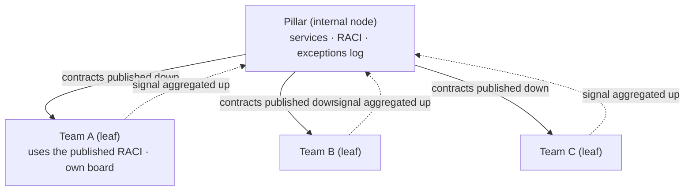
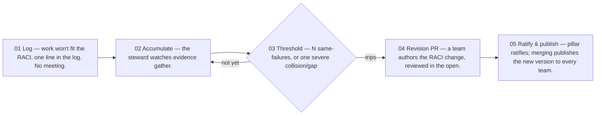

# Two feedback loops + a plan↔execution bridge

Three mechanisms for where teams meet a pillar — and why a pillar is a different *kind of thing*, not a bigger team.

> **TL;DR** — Feedback *on* the way of working stays inside a team, on a weekly clock. Re-defining
> a **service** lives between teams and up at the pillar, and must run on accumulated evidence, not
> a cadence. Reconciling plan with board is a third thing again — a continuous sync. So a pillar is
> a different kind of node — it sits [*above* teams](#the-tier-tree--leaf-vs-internal-nodes) rather
> than beside them — and it rests on one table mapping activities to teams: services are read off
> that table, and incoming projects are broken down against it.

Draft, for review. Team names and activities throughout are placeholders.

## The problems this must solve

| # | Problem | Covered by |
| --- | --- | --- |
| P1 | No live picture of who's working on what, so leadership can't see where to add or shift people. | the bridge |
| P2 | The planning model (goals, services, dependencies) and the board (epics/stories) don't reflect each other. | the bridge |
| P3 | Routing and classification are ambiguous; the service definition drifts as ambiguous work arrives. | the two loops + the activity RACI |
| P4 | Planned work, maintenance, and incidents are managed as one undifferentiated stream. | falls out of P2 + P3 |
| P5 | Cross-team critical-path blocks surface only after they've sunk a deliverable. | the bridge |
| P6 | Early on, while the way of working is still new, people must both *feel* and *be* heard. | the two loops + the activity RACI |

## The principle both loops share

> People *feel* heard when their input produces a visible change — or a recorded, reasoned *no*.
> People *are* heard when the system captures their reality whether or not they had words for it in
> a meeting.

**Stated feedback** is what someone says in a retro. **Revealed feedback** is what their sessions
show — usage-coach, digests — the channel that survives a thin week. Both loops close the same way:
the change ships as a **git diff**, so "we heard you" is auditable rather than a feeling.

## Two loops, two triggers

| | Loop 1 — feedback ON the way of working | Loop 2 — service-definition drift |
| --- | --- | --- |
| Scope | Inside one team's repo. Fits awow today. | Between teams and up to the pillar. Reaches past what one team can decide. |
| Trigger | The clock — a weekly 20–30 min retro, kept frequent while the learning rate is highest. | Evidence, not a clock. Reviewing a definition on a cadence destabilises it. |
| Mechanic | Rotate the convener; the tooling (usage-coach) supplies the agenda, the human just convenes. | Log, don't meet: every time work won't fit the RACI, one line in the exceptions log. |
| Closure | A diff to conventions, *or* a recorded "heard X, chose not to act because Y." | Revise when N same-failures pile up, *or* one severe collision/gap appears. |

## The tier tree — leaf vs internal nodes

"Team vs pillar" is really **leaf vs internal node**, and it nests: team → pillar → department →
org. Same tooling everywhere; only the *role* differs.

## Different nouns, different flow

| Dimension | Team repo (leaf) | Pillar repo (internal) |
| --- | --- | --- |
| Domain nouns | people · stories · board · code | teams · services · exceptions · boundaries |
| Unit of work | a story | a boundary contract |
| Pipeline | refinement → process-workitem → PR | exception → accumulate → threshold → revision PR → ratify → publish |
| Register | the team's backlog | service map + exceptions log (not a backlog) |
| Required setup | `context/tooling/board.md` | `context/services/` (activities + map + log) |
| Data-flow direction | consumes only (copies awow in as a dependency) | **bidirectional** — publishes down, aggregates up |
| Rhythm | daily / weekly cadence | mostly dormant + event-triggered |
| Has code? | often | no — governance only |

The bidirectionality is the new machinery, and why a pillar can't be "a team repo with extra files"
— that would drag along a story-delivery pipeline that means nothing at pillar level. The fix isn't
a second product but the same tooling parameterised by node role (`role: leaf | internal`) with a
parent pointer, the same way `phase:` frontmatter already controls which commands are visible.

## One activity RACI holds it together

The basic unit is the **activity** — the lowest-granularity unit of work, concrete enough to assign
unambiguously, which is why it beats fuzzy "services". **One** RACI maps activities → teams;
services distil up from it, project routing decomposes down through it. There is no separate
"service RACI" — service drift *is* activity-RACI drift, and the invariant is **exactly one
Accountable team per activity**:

| Activity | Service | Accountable |
| --- | --- | --- |
| Ingest raw events | Data ingestion | Team A |
| Normalise schema | Data ingestion | Team C |
| Reconcile shared records | Shared records | ⚠ Team A & B — overlap |

The ways it breaks *are* the drift triggers, all visible at activity granularity: a **gap** (no
Accountable team → coverage hole), an **overlap** (≥2 → boundary conflict), and **service drift**
(a service whose activities scatter incoherently). Each unplaceable activity is one log line.

## How the event cadence runs

Teams *author* their boundaries; the pillar *ratifies* coverage coherence — ratification, not
dictation. The moment the pillar hands teams their definitions, the autonomy that drives adoption
dies, and "feel heard" with it.

## The plan↔execution bridge

The loops and the RACI govern the *definition* of work; they do **not** keep plan and execution in
sync. That gap — between plan and execution — is where P1, P2 and P5 live, and it decides whether a
portfolio roll-up is truth or fiction. It is a *sync*, not a feedback ritual, running in two
continuous directions:

- **Down — translation.** A plan node decomposes into **activities**, each routed to its Accountable
  team by the RACI, then estimated according to rules a human sets. An activity that won't route is
  exactly an exceptions-log entry.
- **Up — reconciliation.** As work moves on the board, status flows back to the plan node so the
  portfolio stays current — the leaf agent's existing board maintenance, extended.

Maintained by hand, the link rots within a sprint — recreating at pillar level exactly the drift
awow exists to remove. So the mapping is a **versioned, owned artifact**, not an integration
script. Not at day zero, though: routing is wrong while definitions are fuzzy. Pilot on one
well-defined plan node, let the threshold mature the definitions under it, then widen.

Where the plan already lives in an external EA system, awow doesn't duplicate it: that system stays
authoritative, awow owns only the **linkage** and **up-reconciliation**, and even the RACI becomes
a read-only copy of that system's data. The leaf agent maintains the links, the steward owns the
translation directive — no new human role.

## Sources of truth

- [`proposals/cross-team-feedback-and-service-drift.md`](../proposals/cross-team-feedback-and-service-drift.md) — the proposal this page accompanies: full argument and open questions
- `context/services/` — a pillar's activity map, service distillation, and exceptions log (not shipped; the required setup)
- [`.agents/commands/okr-cascade.md`](../.agents/commands/okr-cascade.md) — the department-tier read surface the up-aggregation feeds
- Companion guides: [program portfolio view](program-portfolio-view.md) — the up-aggregation rendered
