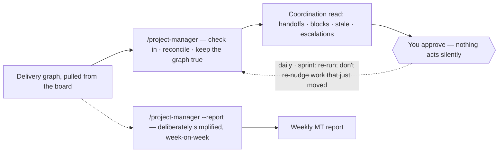
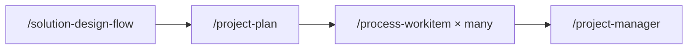

# Coordinating delivery

The forward, operational view of the board — the part of awow that *steers* on the work rather than feeding, wiring, or reading it.

> **TL;DR** — `/project-manager` loads the delivery graph from the board, checks in with the people
> behind in-flight and stalled items to unblock them, cross-references the plan against real code
> and board activity, and re-groups everything into coordination buckets: handoffs ready to fire,
> blocked/waiting, stale/idling, scarce-resource bottlenecks, critical path at risk. It proposes
> check-ins, graph corrections, and escalations, and takes none without approval. Weekly,
> `--report` mode turns the same read into the management roll-up.

**Parked (2026-07-03):** no active adopter runs this loop, and `/awow-add` declines to wire a
parked command unless explicitly overridden. The command file and this guide stay as the design
record; the revisit condition is a second team adopting the delivery chain. Everything below
describes how it works when active.

## Where it sits among its neighbours

Four commands touch the same board from different directions. `/project-manager` is the only one
that looks *forward* across the whole team; the others are personal or retrospective. Reaching for
the wrong one is the common confusion.

| Command | Direction | What it does |
| --- | --- | --- |
| `/my-work` | inbound · personal | What the board is asking of *one person* — their queue, surfaced and prioritised. |
| `/daily-checkin` | outbound · personal | Someone narrates their own day; the agent reconciles it onto the board. |
| `/daily-digest`, `/weekly-digest` | retrospective · team-wide | What the team already shipped, synthesised at rising altitudes. |
| `/project-manager` | forward · delivery | Checks in across the team to unblock people, keeps the graph true, surfaces what only management can clear. |

## What it needs before it can run

1. **A delivery graph already exists** — work decomposed into dependent tasks and reflected on the
   board. Where the board carries no formal dependency edges, the command reconstructs them from
   the solution-design artefacts and issue content and **marks every inferred edge as inferred**.
2. **The agent can read and write the board** (Step 0 of `/setup-awow` complete), through the
   surface named in `context/tooling/board.md`.
3. **More than one person or team is coordinating on shared work.** For one person on independent
   stories, `/my-work` is the right tool; coordination earns its keep once handoffs and contended
   resources exist.

It coordinates a graph — it cannot conjure one. Run it against an empty or untended board and it
has nothing to steer; the answer then is to run the delivery loop first, not to run this harder.

## The coordination loop

Two rhythms. The operational loop runs daily-to-sprint; once a week the same agent, in `--report`
mode, rolls the same graph up to the management team at a higher altitude.

## How a run goes, step by step

| Step | What happens |
| --- | --- |
| **1 · Resolve scope & cadence** | Decide which graph to load — a project, a team, all active work — and respect cadence. Rebalancing too often burns the team the way frequent trades burn returns in fees. |
| **2 · Load the delivery graph** | Pull the items in scope and the edges between them: state, assignee, blocked flag, last-update time, parent, acceptance criteria, dependency links. Infer missing edges from design artefacts and issue content, *marked inferred*. Sanity-check thin results — an empty graph on work you know is active usually means a mistyped scope or stale credentials. |
| **3 · Check in with the people** | Reach out to owners of in-flight and stalled items rather than only reading their tickets. Three questions at most: where the work stands, what is blocking, what would help. Skip anyone whose work already moved today. |
| **4 · Reconcile plan against actual** | The graph is the plan and it drifts the moment work starts. Cross-reference planned sequence, ownership, estimates, and states against real code activity, board movement, and the check-in answers. Where they diverge, the plan is usually the stale one — propose realigning it. |
| **5 · Compute the coordination read** | Re-group everything into the buckets below, deciding what each item *needs now*. |
| **6 · Maintain the dependency graph** | Expect it to be incomplete; keeping it correct is the job. Propose the fix — a ticket for a component the design named but the board never captured, a real dependency edge, an owner for an unassigned item, acceptance criteria for an item that will stall without them. |
| **7 · Propose and act — at the gate** | End with concrete follow-ups grouped by type, and take none without explicit approval. |

## The coordination read

The output that makes the command worth running: work re-grouped by what each item *needs*, so
the read is a set of decisions rather than a status board.

| Bucket | What lands in it |
| --- | --- |
| **Critical path at risk** — *surface first* | Items on the critical path that are slow or blocked. They threaten the whole delivery, not just their own branch, so they lead the read. |
| **Handoffs ready to fire** — *momentum* | A predecessor just completed and its dependents are now unblocked. Name the finished item, the newly-ready successor, and its owner — these move the moment someone is told. |
| **Blocked / waiting** | Name the single person or dependency each item waits on, split into **team-resolvable** and **escalation-only**. |
| **Stale / idling** | In progress with no movement in N working days (default 3), or people idling behind a stuck upstream dependency. |
| **Scarce-resource bottlenecks** — *the escalation candidate* | Several items queued behind one contended resource — a single security reviewer, a shared environment, one architect. The teams cannot solve this themselves; management decides who gets the resource or whether it can be replicated. |

## The gate — propose, never act silently

Everything up to here is read-only. The command ends by showing concrete follow-ups it *could*
take, grouped by type, and waits:

- **Check-ins to send** — the per-person messages, shown *verbatim* so the wording can be approved
  before any go out.
- **Graph corrections** — missing tickets, dependency edges, owners, acceptance criteria, and any
  board state that drifted, each following the team's board-output rules.
- **Nudges / board actions** — a comment recording a blocker, a move for an item whose real state
  has drifted.
- **Escalations** — the items only management can unblock, each stated as *the decision needed*,
  not just the problem.

One question is asked — *"Should I send the check-ins, apply the graph corrections and board
actions, raise the escalations?"* — each match is re-verified before it is touched, and ambiguity
surfacing mid-execution stops the run.

## The weekly MT roll-up — `--report` mode

The same agent, reporting upward. Information gets more abstract the higher it goes, so this is
deliberately simplified and week-on-week. It is written to `reports/mt/YYYY-Www.md` and never
shared without explicit approval.

| Question | What the report says — and its honesty rule |
| --- | --- |
| **1 · On track?** | Per active project: on track / blocked / slowing. Names only the blockers **management** can clear — the decisions waiting on them. |
| **2 · Still delivering the expected value?** | Whether each project is still worth what it was scoped to deliver. This is the question that surfaces sunk cost — it flags a project whose value has eroded *even if it is "on track"*. |
| **3 · Has the external signal shifted?** | Market or external changes that alter the premise a project started on. Grounded in supplied material only: **no fabricated market signals, no external links without approval**. |

Only question 1 reads straight off the board today. Question 2 needs a value-measurement
instrument the team must put in place; question 3 needs an outside-in feed the board does not
source. The honest report shows what it has and flags what it doesn't — it does not colour an
unknown green.

## Anti-patterns — how it stays trustworthy

| Don't | Why |
| --- | --- |
| **Don't just report** | A run that only summarises and proposes nothing actionable has missed the brief. Be a project manager, not a project reporter. |
| **Don't interrogate** | Check-ins offer help and clear blockers. The question is "what would help", not "why isn't this done". |
| **Don't echo the board** | A flat list of every open issue is the problem this command solves, not its output. |
| **Don't let plan and graph drift** | When code activity and check-ins contradict the board, reconcile. A graph that no longer matches reality is worse than none, because people steer on it. |
| **Don't over-coordinate** | Re-nudging the same people every few hours is overhead. Respect cadence; let people work. |
| **Don't act silently** | Read-only until the gate, always. |
| **Don't invent dependencies** | Never present a reconstructed dependency as confirmed. |
| **Don't escalate everything** | Escalation is for what the team genuinely cannot resolve — a contended resource, a cross-team priority call. Routine blockers are not management material. |
| **Don't evaluate people** | Idling and stale items are flow signals about the graph, not judgements about individuals. |

## Where it plugs into the rest of awow

Coordination is the last link in a chain that turns on one shared artefact: a **stated dependency
graph**, *stated* by `/project-plan`, *honoured* by `/process-workitem`, and *steered on* here.
Without it stated somewhere true, coordination has nothing to read — which is why it is a
first-class deliverable, not a by-product of reconciliation.

Each command's role in that chain is in [the core delivery loop](guide-core-delivery-loop.md).

## Sources of truth

- [`.agents/commands/project-manager.md`](../.agents/commands/project-manager.md) — the seven steps, the coordination buckets, and the gate
- [`.agents/commands/project-plan.md`](../.agents/commands/project-plan.md) — where the dependency graph this loop steers on is stated
- [`.agents/commands/solution-design-flow.md`](../.agents/commands/solution-design-flow.md), [`.agents/commands/process-workitem.md`](../.agents/commands/process-workitem.md) — the upstream chain that builds and honours the graph
- [`.agents/AGENTS.md`](../.agents/AGENTS.md) — the spine rules, including board-output discipline
- `context/tooling/board.md` — the board surface it reads and writes through; written by `/setup-awow`
- Companion guide: [the core delivery loop](guide-core-delivery-loop.md)
