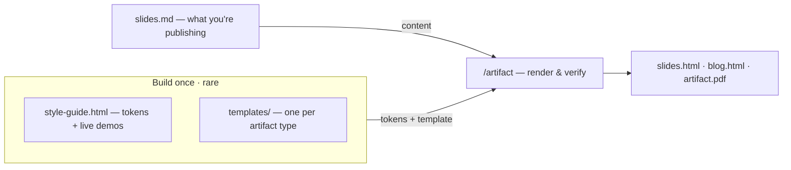

# Design systems & HTML artifacts

Stand a design system up once; produce decks, blogs, and solution designs from it many times — without re-deciding the styling each time.

> **TL;DR** — A design system is a durable team artifact: built once by `/design-system`, then
> every deck, blog, and one-pager is rendered from it plus a content file by `/artifact`. Opt-in —
> the shipped config file says `absent`, so board-only teams never touch it and no command invents
> a house style.

## What a design system is here

Not a token JSON file and not a Sass package — a small set of hand-readable, self-contained
artifacts.

| Artifact | What it is |
| --- | --- |
| `style-guide.html` | One self-contained page: tokens as CSS variables plus *live component demos*. The source of truth. Versioned; old versions deprecated explicitly. |
| `templates/<type>/` | One `template.html` + `TEMPLATE.md` per artifact type. The HTML carries the full token block; the markdown carries a content→component map, so an artifact generates without re-deriving anything. |
| `context/tooling/design-system.md` | The pointer: whether a system exists and where. Every artifact-producing command reads it first. |
| `CLAUDE.md` rule | A rule the agent must follow: when producing an artifact and a system is present, read the source and use it — never invent styling. |

One self-contained page means no build step — open it anywhere, mail it, print it to PDF. The cost
is tokens duplicated across files.

## The pointer — one place that knows

| `mode:` | Meaning |
| --- | --- |
| `absent` | The shipped default. No system; artifacts use plain accessible defaults. |
| `in-repo` | Lives under `context/design-system/` — self-contained, no cross-repo fragility. |
| `external` | Another repo, by absolute path. Read from the filesystem — a board MCP will 404 on a private repo. |

That one field is what lets "follow the design system if present" mean something everywhere — a
command reads it and either enforces or stands down. One rule applies in every mode: commands
**re-read the source before generating**, because the pointer's token summary is a cache and can
drift.

## Establishing it — `/design-system`

Rare, once per brand. Three gates: stop, show the work, wait for approval. You build the thing
artifacts are generated *from* — no deck comes out of this command.

1. **Gate 1 — source & method.** Capture a reference site's *computed styles* with a headless
   browser — colours, fonts, sizes, tracking, not screenshots. Extract the **method** and re-express
   it in your own tokens; don't clone a palette and call it a system.
2. **Gate 2 — tokens & rules.** Resist a sprawling palette. The set that actually does the work:
   one background, one surface, **one accent**, a three-step text ramp, named *semantic* tints, a
   spacing scale. Pick fonts, cap the weight.
3. **Gate 3 — write & wire.** Style-guide page with live demos, `template.html` + `TEMPLATE.md` per
   artifact type, pointer set. Render it in a browser first — never ship a guide you haven't seen.

## Producing an artifact — `/artifact`

Frequent, every artifact. It gates on content before generating, because regenerating HTML from
changed markdown is cheap and rewriting hand-tuned HTML is not.

1. **Content first.** Agree the markdown; the approval happens before any HTML exists.
2. **Generate from the template**, after re-reading the source. Keep its `<style>` and nav verbatim.
   Prefer HTML/CSS diagrams over raw SVG or Mermaid.
3. **Verify, then export.** Layout in a headless browser, PDF via Chrome headless. Fix overflow,
   regenerate.
4. **Ship it.** Commit markdown + HTML + PDF; update the board.

On an `absent` pointer it offers `/design-system` first, or proceeds with plain defaults on your
say-so. It never fakes a house style.

## How it plugs into the rest of awow

| Where it shows up | What it does with the design system |
| --- | --- |
| `CLAUDE.md` rule | "When you produce a styled artifact (HTML or Word)" — read the pointer, adopt when present, re-read the source each time. Applies to ad-hoc output that never goes through `/artifact`. |
| `/solution-design-flow` | Phase 0 reads the pointer; the presentation track adopts the system and hands generate-and-render mechanics to `/artifact` rather than duplicating them. |
| `/setup-awow` Step 8 | Detects an existing system; if none, asks one question — "do you produce styled HTML artifacts?" — and on yes suggests `/design-system`. Implicit, opt-in, never auto-run. |
| Digests | A styled digest adopts the same tokens, so it looks like it belongs to the team rather than to the tool. |

## The visual rules

- **The accent colour is for the wordmark or a single emphasis** — never a background fill.
  Hierarchy comes from weight, not colour.
- **Borders over shadows** — 1px and a small radius. Calmer, and it prints.
- **Semantic tints** — each family *means* something (plan, action, reference). Colour carries
  information, not decoration.

## Open questions each team answers for itself

- In-repo or external? External wins when design assets already live elsewhere.
- Which artifact types earn a template? Every type you produce more than once or twice.
- Is Chrome headless available for print-to-PDF? If not, pick an exporter and constrain the CSS.
- Should a lint check the pointer's cached tokens against the style guide, or do you just trust the
  rule?
- If awow ships with its own design system configured, adopters must reset the file to `absent`
  after cloning.

## Sources of truth

- [`.agents/commands/design-system.md`](../.agents/commands/design-system.md) — the three gates, the teardown method, the token discipline
- [`.agents/commands/artifact.md`](../.agents/commands/artifact.md) — the content-first pipeline, verification, PDF export
- [`context/tooling/design-system.md`](../context/tooling/design-system.md) — the pointer and its three modes
- [`.agents/commands/setup-awow.md`](../.agents/commands/setup-awow.md) (Step 8) — the opt-in moment
- Companion guides: [solution-design collaboration](guide-solution-design-collaboration.md) — the presentation track's biggest consumer; [standardise reporting](guide-standardise-reporting.md) — digests on the same tokens
