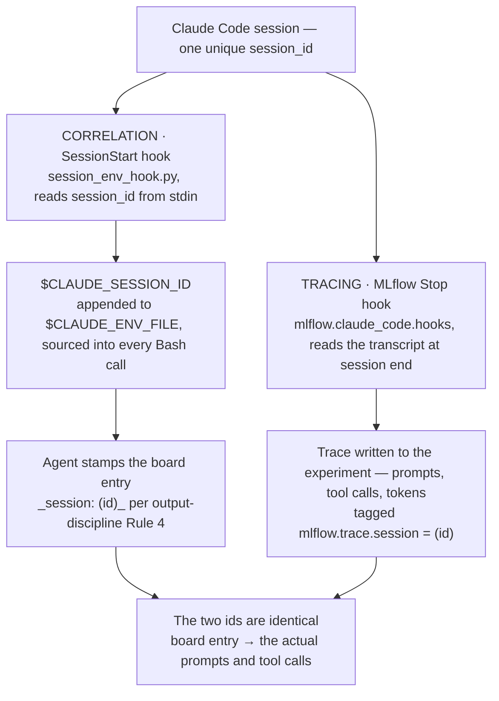

# Session correlation

Every board entry the agent writes carries a back-link to the session that produced it.

> **TL;DR** — When the agent opens or comments on an issue it appends one line, `_session: <id>_`.
> That id is the harness session id, and it is exactly the id the MLflow Stop hook tags the
> session's trace with — so from any board entry you reach the prompts and tool calls behind it.
> The agent learns its own id from `$CLAUDE_SESSION_ID`, populated once per session by a small
> `SessionStart` hook. None of this creates traces; it only links to traces you already record.
> Opt-in, and gated on tracing already being wired.

## Why it's worth doing

Agent-authored issues and PRs normally have **no provenance**: you can read *what* was decided, not
*how*. That gap costs three things.

- **Auditability.** "An agent wrote this" is only credible if you can open the session behind it.
- **Coaching.** `awow-usage-coach` and `prompt-skill-analysis` assess *how* people prompt; they can
  only tie feedback to outcomes when board entries name their session.
- **Digests.** `daily-digest` and `weekly-digest` join board activity to session data. Without the
  id the two surfaces stay disconnected.

## How it works

Two independent tracks run during a session and meet at a shared id. Correlation (this skill) makes
the id available and stamps it on the board; tracing (owned elsewhere) writes the trace and tags it
with the same id.



The id is ambient rather than contextual: it lives shell-side, so it costs nothing per turn and
survives compaction and `/clear`, and the hook re-runs on resume/clear/compact to stay populated.
Downstream skills filter traces by that id to reunite outcome with process.

## What is responsible for what

The capability is deliberately small. It sits on top of a tracing stack that is already running.

| Component | Lives in | Responsible for |
| --- | --- | --- |
| **claudetracing** *(tracing)* | `../claudetracing` (sibling repo) | Provisioning the Databricks MLflow side. Pointed to, never duplicated. |
| **MLflow Stop hook** *(tracing)* | `.claude/settings.local.json` (per-machine) | Writing each session's trace and tagging it `mlflow.trace.session = <id>`. |
| **`session_env_hook.py`** *(correlation)* | `.agents/skills/session-correlation/scripts/` | The accessor: exposing the session id as `$CLAUDE_SESSION_ID` via a `SessionStart` hook. |
| **Footer rule (Rule 4)** *(correlation)* | `context/team/conventions/REQUIRED/output-discipline.md` | Instructing the agent to append `_session: <id>_` to board entries it authors. |
| **`gather.py`** | `tools/` | Mirroring the rule + skill into the harness surfaces (`.claude/`, `.github/`) so Claude Code and Copilot both see them. |
| **`/setup-awow` Step 3 · `/awow-add`** | `.agents/commands/` | The opt-in moment: runs the tracing prerequisite check, then installs the accessor + footer rule. |

## How the configuration happens

### 0 · Prerequisite check

The skill refuses to proceed if tracing is not wired — otherwise it would stamp footers pointing at
traces that were never written. It looks in `.claude/settings.local.json` for both markers:

```jsonc
{
  "env": {
    "MLFLOW_CLAUDE_TRACING_ENABLED": "true",
    "MLFLOW_TRACKING_URI": "databricks://<profile>",
    "MLFLOW_EXPERIMENT_NAME": "/Workspace/Shared/<team>",
    "DATABRICKS_CONFIG_PROFILE": "<profile>"
  },
  "hooks": {
    "Stop": [ { "hooks": [ { "type": "command",
      "command": "uv run python -c \"from mlflow.claude_code.hooks import stop_hook_handler; stop_hook_handler()\"" } ] } ]
  }
}
```

If the check fails it stops and points you at `../claudetracing`. It will help wire the local
`settings.local.json` against it, but it never owns tracing setup.

### 1 · Wire the accessor hook

Added to the same per-machine `settings.local.json`. Takes effect on the next session (or on
resume/clear/compact).

```jsonc
"SessionStart": [ { "hooks": [ { "type": "command",
  "command": "python3 \"$CLAUDE_PROJECT_DIR/.agents/skills/session-correlation/scripts/session_env_hook.py\"" } ] } ]
```

### 2 · Install the footer rule

The skill appends Rule 4 to `output-discipline.md` and a shape note to `board-output.md`, then
re-runs `gather.py`. The base templates stay clean — the rule lands only for teams that opted in.

```markdown
## Rule 4 — Session footer
Every board entry you author ends with:

    _session: <session-id>_

Read the id from $CLAUDE_SESSION_ID. It matches the trace's
mlflow.trace.session tag, joining board content to traces.
Exempt: metadata-only changes and one-line status comments.
```

### 3 · Verify

- In a fresh session, `echo "$CLAUDE_SESSION_ID"` prints the current id — the same id as the
  transcript filename under `~/.claude/projects/<project>/`.
- Have the agent post a test comment; confirm the `_session: <id>_` line is present and that the id
  resolves to a trace in the team's experiment.

## Scope boundaries

| In scope | Out of scope |
| --- | --- |
| Exposing the session id to the agent (`$CLAUDE_SESSION_ID`) | Setting up MLflow / Databricks tracing — that is `claudetracing` |
| The footer convention, and where it is required vs. exempt | Writing traces — that is the Stop hook |
| The opt-in flow and the tracing prerequisite check | Forcing anything into the always-read core instructions |

The footer rule is written harness-neutrally ("your harness's session id"). The accessor shown here
is Claude-Code-specific (`SessionStart` + `CLAUDE_ENV_FILE`); other harnesses keep the same footer
and supply their own accessor. GitHub Copilot is verified end to end with its equivalent accessor,
but that support is landing via a pull request that is still pending, so for now it lives outside
the merged template.

Correlation is only the join. What you *do* with the traces — export, prompt-quality reports,
usage coaching — is [trace analysis](guide-trace-analysis.md).

## Sources of truth

- [`.agents/skills/session-correlation/SKILL.md`](../.agents/skills/session-correlation/SKILL.md) — the capability: the accessor hook, the footer rule, and the opt-in flow
- [`.agents/skills/session-correlation/scripts/session_env_hook.py`](../.agents/skills/session-correlation/scripts/session_env_hook.py) — the accessor itself
- [`context/team/conventions/REQUIRED/output-discipline.md`](../context/team/conventions/REQUIRED/output-discipline.md) — where Rule 4 lands for a team that opted in
- [`.agents/commands/setup-awow.md`](../.agents/commands/setup-awow.md) (Step 3), [`.agents/commands/awow-add.md`](../.agents/commands/awow-add.md) — the opt-in moments
- Companion guides: [trace analysis](guide-trace-analysis.md) — the read side that consumes the join; [session timeline](guide-session-timeline.md) — the visual read of the same sessions
