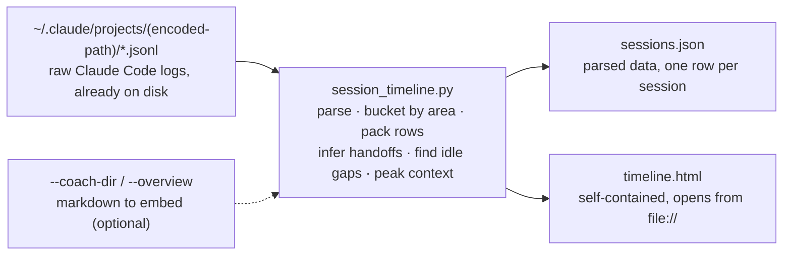

# Session timeline

An interactive visual timeline of a project's Claude Code sessions, built straight from the raw logs — no tracing setup required.

> **TL;DR** — `tools/session_timeline.py` reads the JSONL Claude Code already writes under
> `~/.claude/projects/` and emits `sessions.json` plus a self-contained `timeline.html` (vanilla JS
> + SVG, no server, no CDN). The page is a Gantt swimlane of every session with a concurrency
> strip, handoff arrows, idle gaps, and per-session peak context; click a bar for its detail panel.
> Its one advantage over the MLflow path: it needs no MLflow, no Databricks, no Stop hook — just
> the logs on disk. Ships in the `awow-telemetry` plugin (`/plugin install awow-telemetry@awow`).

## From raw logs to one HTML file



Everything the page needs is inlined at build time, so it survives being emailed or committed.

## What the timeline shows

The page is one tall SVG read top to bottom. Each element answers a different question about how
the work actually unfolded.

| Element | What it reveals |
| --- | --- |
| **Gantt swimlane** | One bar per session: width is duration, colour is the **functional area** (the top-level dir most touched), hatching means read-only. Bars are packed into rows so overlapping sessions stack instead of colliding. |
| **Concurrency strip** | A band across the top counting how many sessions ran **simultaneously** at each moment — the fan-out / contract rhythm made visible. |
| **Handoff arrows** | An arrow from an earlier session to a later one when the later session edited files the earlier one last wrote (inferred per-file last-writer). |
| **Idle gaps** | Grey bands where **no session logged any event** — the difference between active time and elapsed time. |
| **Peak context** | Per session, the input + cache tokens at its fullest turn plus total output tokens. Sessions past the standard 200K window are flagged. |
| **Detail panel** | Click any bar for that session's area, duration, peak context, file footprint, and handoff links. |

Three of those repay a closer look:

- **Row packing.** A session takes the first row whose last bar ended before it starts. Without
  packing, concurrent sessions would draw on top of each other and the parallelism — the thing the
  concurrency strip counts — would be invisible.
- **Idle is computed from event spacing**, not from session open/close times. A session left open
  while the human is away is not active. Read the grey bands as questions, not waste: the timeline
  says where the day went, not whether that was good.
- **Peak context beats a running total** as a health signal — it is how close that session came to
  filling its window, and it separates heavy context-hungry work from quick focused runs.

## One evening, or many days

When a project's sessions span more than one day, the page switches automatically to **calendar
mode**:

- A **day-navigator strip** runs along the top, one cell per *active* day, height scaled to that
  day's session count. Long empty stretches collapse to a `// 12d` marker, so a four-month project
  stays a few screens wide.
- **Click a day, or press ←/→**, to load that day's full detail below — the same swimlane, strip,
  and idle gaps scoped to that day's hours.
- **Sessions resumed across days** are placed on their start day and clipped at midnight with a
  `→ +Nd` marker, so one long-lived id never stretches the whole axis.

## How to run it

```bash
python tools/session_timeline.py \
    --project-path <repo> \
    --transcripts ./_exports \
    --coach-dir ./coach_reviews \
    --overview ./OVERVIEW.md \
    --tz-offset 2 \
    --out .
```

| Flag | Purpose |
| --- | --- |
| `--project-path` | The repo whose sessions to render; locates the encoded log dir under `~/.claude/projects/`. |
| `--mlflow-export` | *Alternative source.* An `mlflow_export/` dir of Databricks traces instead of local logs. Supports multiple users. |
| `--user` | *Optional.* Scope an MLflow export to one user (matches `mlflow.user`, local-part or email). |
| `--transcripts` | An export directory of the session JSONL to read. |
| `--coach-dir` | *Optional.* Per-session coach reviews (markdown); a matching review is embedded in that session's panel. |
| `--overview` | *Optional.* A whole-project overview markdown, embedded as the **default panel** — what you see before clicking any bar. |
| `--tz-offset` | Hours offset from UTC, so the wall-clock axis reads in local time. |
| `--out` | Where to write `sessions.json` and `timeline.html`. |

To read Databricks traces instead of local logs, swap the source flag:

```bash
python tools/session_timeline.py \
    --mlflow-export ./mlflow_export/<experiment> \
    --user casper \
    --tz-offset 2 \
    --out coach_reviews/<repo>-retrospective
```

Then double-click `timeline.html`. No build step, no local server, no network. Both embed inputs
are markdown you bring — the tool only renders and places them, which keeps the picture and the
prose separable while letting them appear in one view.

## Where it fits among the analysis tools

This is the visual, zero-setup on-ramp to awow's session analysis: the picture that
[trace analysis](guide-trace-analysis.md) describes in words, and it reads Claude Code's own JSONL
so there is nothing to wire up first. The trace-analysis path (`mlflow-export` →
`prompt-skill-analysis` / `awow-usage-coach`) needs traces already recorded by a Stop hook; embed
that prose coaching here via `--coach-dir`, and defer to those skills for a deep read.
[Session correlation](guide-session-correlation.md) is a different concern — board↔trace plumbing —
which this tool does not touch.

**Two sources, different fidelity.** The local-log path (Claude Code only) carries the most detail:
file edits, per-turn context, handoff arrows. The MLflow path works for any traced harness and
supports multiple users, but traces carry no file paths (bars colour by working directory) and no
per-turn context. Copilot teams use the MLflow path.

## Sources of truth

- [`tools/session_timeline.py`](../tools/session_timeline.py) — the engine; emits `sessions.json` and `timeline.html`
- [`tools/session_timeline_template.html`](../tools/session_timeline_template.html) — the self-contained view it fills
- [`.agents/skills/project-timeline/SKILL.md`](../.agents/skills/project-timeline/SKILL.md) — the judgment layer: scope, cost-gating, reading the picture, coaching
- Companion guides: [trace analysis](guide-trace-analysis.md) — the export-then-assess pipeline this pictures; [session correlation](guide-session-correlation.md) — the board↔trace plumbing
