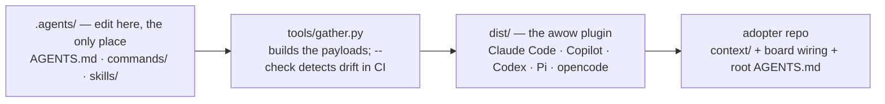

# Setup & the plugin model

What a new adopter hits first: the `/setup-awow` wizard, and how one source tree becomes the
plugin bundle every harness installs.

> **TL;DR** — `/setup-awow` is a wizard you run inside an agent session, incremental and
> resumable against `setup-progress.md`. Choose a guided walkthrough or ask it for a 25–30 minute
> team workshop brief and give it the transcript afterward; both routes end at the same approval
> step before anything is written. Only Steps 0 and 1 are required for operation. Separately, all
> agent instructions are authored once under `.agents/` in the awow repo; `tools/gather.py`
> builds them into the plugin payload under `dist/`, and that payload is what every harness
> installs — nothing is mirrored into an adopter's `.claude/` or `.github/`.

## How the wizard behaves

Four properties define how it runs:

- **Workshop or guided.** The optional workshop route lets the team explain its mission, work flow,
  rituals, and agreements in one conversation. Technical board and harness wiring happens outside
  the meeting. Teams that do not want a meeting use the guided route unchanged.

- **Incremental & resumable.** State lives in `setup-progress.md` at the repo root, read on every
  invocation, so you can stop after any step and pick up exactly where you left off.
- **Always shows the whole map.** Before doing anything it lists every step (0 → 9), marks each
  ✓ complete / ⧗ deferred / ☐ untouched, and says which one it is resuming. You never see a step
  in isolation.
- **Proposal-first.** Every artefact is written to `proposals/setup/<step>/` first and moves to
  its final location (e.g. `context/team/mission.md`) only after explicit approval.
- **Two required, the rest optional.** Steps 0 and 1 make the repo usable. Steps 2–9 are
  recommended-next in any order — the wizard offers the next one and lets you choose.

For the workshop route, `/setup-awow` drafts `proposals/setup/meeting-brief.md` with five short
conversation blocks. After the meeting, pass the `.vtt`, `.srt`, or notes to `/setup-awow` or
`/process-transcript`. The synthesis distinguishes current practice, agreed changes, suggestions,
and unresolved disagreement, then shows one approval gate with the actual proposed diffs. Common
rituals produce a file under `context/team/meetings/` only when this team's rituals differ
materially from the generic defaults awow already ships; custom recurring meetings can be
described there in full.

**Multi-workspace runs.** `/setup-awow --root <path>` resolves `setup-progress.md`,
`proposals/setup/` and `context/` relative to `<path>/` instead of the repo root.

## The step map (0–9)

| Step | Name | Required? | Outcome |
| --- | --- | --- | --- |
| **0** | Installer | required | In a plugin install: nothing to install — the commands already reach you from the payload, so the step records `n/a` and moves on. Only an older install that copied awow's files into the repo ("vendored") still wires Python via `uv` and runs its own `tools/gather.py`. |
| **1** | Board kickoff | required | A working read/write connection to your board (MCP or `gh` CLI) plus a fully-populated `context/tooling/board.md` — states, hierarchy, labels, fields, team-page conventions. |
| **2** | Team profile | recommended | A few plain sentences — what the team works on, for whom, and its tech stack (mission line optional) — drafted from the board and repo, then saved to `context/team/mission.md`. |
| **3** | Required conventions | recommended | The four REQUIRED conventions (`issue-titles`, `labels`, `branches`, `output-discipline`), observed from the board or guided from reference. The wizard will not let you skip `output-discipline.md`. |
| **4** | Members & style | recommended | Team member list plus the style files (`board-output`, `comments`, `placement`, `prose`) drafted from templates. |
| **5** | CLAUDE.md / AGENTS.md bootstrap | recommended | A team-specific root `CLAUDE.md` / `AGENTS.md` (including the `## Do not propose` block) — the team's own file, which awow never regenerates. |
| **6** | Knowledge base seed | recommended | A seeded `glossary.md` and stubbed architecture / patterns / runbooks / decisions subfolders. |
| **7** | Neighbouring teams | recommended | Stubs at `context/company/neighbouring-teams.md` for the 1° teams you depend on or supply. |
| **8** | Surface the extras | recommended | Lists the `spread` / `standardise` commands with the pain each removes and the prerequisites each assumes. They all ship in the payload; the phase says when a team is ready for them. |
| **9** | Skills review | recommended | One table of the shipped skills — default keep all, name exceptions to customise or drop — surfacing the assumption each bakes in (e.g. "assumes Databricks MLflow"). Re-run whenever the stack changes. |

`/setup-awow --quickstart` does Steps 0 → 1 → 2 → 3 → 5 in one turn with sensible defaults,
skipping the per-step review loop.

## Step 0 — install shape

The wizard first decides what kind of repo it is in:

| Detected | Meaning |
| --- | --- |
| Root `AGENTS.md` frontmatter carries a `hub:` key | A **spoke** — a repo attached to a central team repo (its *hub*). The wizard's Spoke track finishes or repairs that link. |
| Plugin install, no awow files yet | Asks once: standalone, or a spoke of an existing team hub? Records `install-shape` in `setup-progress.md`. Standalone has nothing to install: the step is `n/a`. |
| `.agents/AGENTS.md` and `setup/install.sh` present | A **legacy vendored tree** — the installer path still applies there, and only there. |

The wizard won't copy awow's files into your repo, and won't run an installer against it.

## Step 1 — Board kickoff (required)

The outcome is a working read/write connection to your board *plus* a fully-populated
`context/tooling/board.md` — the team's actual board spec, not just MCP wiring. It runs in two
parts:

- **1a · wire the connection.** Detects or installs the read/write connection — an MCP for
  Linear / Jira / Azure DevOps / GitHub, or the `gh` CLI for GitHub-hosted boards. Verifies
  **read** with one call and **write** with a no-op write against a scratch issue. If the board
  connection can't be finished now, it's recorded as `pending` so the repo is still partially
  usable.
- **1b · configure.** Mode chosen automatically by counting closed issues. **Mode A** (<10 closed)
  drafts the full spec from the reference in one pass. **Mode B** (≥10 closed)
  assesses and captures what is already on the board, recording divergence from the reference.

**One review gate.** The wizard drafts the whole board spec in one pass, summarises it, and asks
once whether to *land* it (save it to its final location), *adjust* a section, or *evaluate* one
against the live board — looping until you say land. No per-section approvals. Full board
mechanics live in [Board & MCP integration](guide-board-and-mcp.md).

## One source, every harness

A team using more than one coding agent hits the same problem: every instruction file, prompt,
and skill ends up duplicated per harness, someone fixes a convention in one copy and forgets the
other, and the agents follow different rules.

awow's answer is **one source, one build, one install.** Everything is authored once under
`.agents/` in the awow repo. `tools/gather.py` renders it into the payloads under `dist/` — full
command copies for Claude Code, the same commands repackaged as skills for Codex, Pi and
opencode, and the Copilot plugin under `dist/.github/plugin/` — and CI fails on drift with
`--check`. Adopters install that payload; their repos hold only `context/`, the board wiring,
and their own root instruction file. There is no per-repo copy of a prompt to drift.



Path tokens make this possible: prompt bodies name `{HUB}`, `{PROJECT}`, `{AWOW_ROOT}` and
`{AWOW_TOOLS}` instead of literal paths, and gather substitutes the harness-correct form at build
time — `${CLAUDE_PLUGIN_ROOT}` for Claude Code, a skill-relative path for Codex and Pi — while
`{HUB}` and `{PROJECT}` ship as-is; the agent fills them in at the start of each session.

## The maintainer loop

The marketplace Claude Code and Copilot install from **is** the awow repo:
`.claude-plugin/marketplace.json` serves `./dist`. So a maintainer dogfoods the exact artifact
adopters get, and a merge to `main` is what reaches their own sessions:

```bash
# after a merge to main
/plugin marketplace update awow
/plugin update awow

# exercise a branch's payload before it merges
python tools/gather.py && claude --plugin-dir dist

# in CI: fail if dist/ drifted from .agents/
python tools/gather.py --check
```

Copilot's equivalent is `copilot plugin marketplace add CauchyIO/awow`; Codex, Pi and opencode
install from `awow-dist`, which carries the same built payload. Nothing is generated into the
awow repo's own `.claude/` or `.github/` — the instruction files there are short hand-authored
pointers to `.agents/AGENTS.md`, and `/test-awow` (the eval runner) is the one command that
lives in `.claude/commands/` rather than the payload.

## Sources of truth

- [`.agents/commands/setup-awow.md`](../.agents/commands/setup-awow.md) — the wizard spec, Steps 0–9 and the Spoke track
- [`README.md`](../README.md) — "Install", "Developing awow"
- [`.agents/AGENTS.md`](../.agents/AGENTS.md) — the canonical rule set and the path tokens
- [`tools/gather.py`](../tools/gather.py) — the payload build and `--check` drift gate
- Companion guides: [board & MCP integration](guide-board-and-mcp.md) — what Step 1 wires and how an MCP joins it; [updating awow](guide-update-and-versioning.md) — the legacy vendored update path against the lockfile
