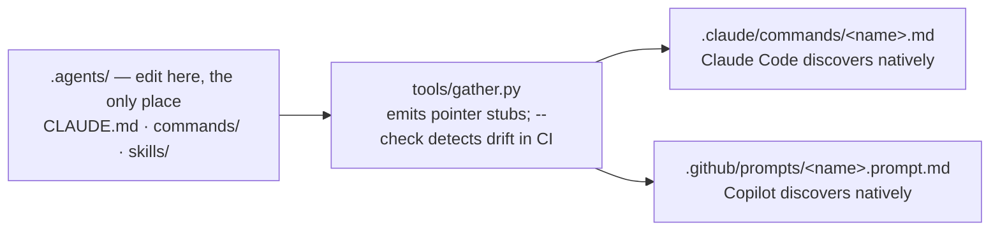

# Setup & the pointer-stub model

What a new adopter hits first: the `/setup-awow` wizard, and how one source tree renders to every harness surface.

> **TL;DR** — `/setup-awow` is a wizard you run inside an agent session, incremental and
> resumable against `setup-progress.md`. Choose a guided walkthrough or ask it for a 25–30 minute
> team workshop brief and give it the transcript afterward; both routes produce the same gated
> proposals. Only Steps 0 and 1 are required for operation. Separately, all agent instructions are authored once
> under `.agents/`; `tools/gather.py` mirrors them into pointer stubs in `.claude/` and
> `.github/` so the two harnesses cannot drift.

## How the wizard behaves

Four properties define how it runs:

- **Workshop or guided.** The optional workshop route lets the team explain its mission, work flow,
  rituals, and agreements in one conversation. Technical board and harness wiring happens outside
  the meeting. Teams that do not want a meeting use the guided route unchanged.

- **Incremental & resumable.** State lives in `setup-progress.md` at the repo root, read on every
  invocation, so you can stop after any step and pick up exactly where you left off.
- **Always shows the whole map.** Before doing anything it lists every step (0 → 9), marks each
  ✓ complete / ⧗ deferred / ☐ untouched, and says which one it is resuming. You never see a step
  in isolation.
- **Proposal-first.** Every artefact is written to `proposals/setup/<step>/` first and moves to
  its final location (e.g. `context/team/mission.md`) only after explicit approval.
- **Two required, the rest optional.** Steps 0 and 1 make the repo usable. Steps 2–9 are
  recommended-next in any order — the wizard offers the next one and lets you choose.

For the workshop route, `/setup-awow` drafts `proposals/setup/meeting-brief.md` with five short
conversation blocks. After the meeting, pass the `.vtt`, `.srt`, or notes to `/setup-awow` or
`/process-transcript`. The synthesis distinguishes current practice, agreed changes, suggestions,
and unresolved disagreement, then shows one approval gate with the actual proposed diffs. Common
rituals produce a file under `context/team/meetings/` only when this team materially differs from
the generic meeting lens; custom recurring meetings can be described there in full.

**Multi-workspace runs.** `/setup-awow --root <path>` resolves `setup-progress.md`,
`proposals/setup/` and `context/` relative to `<path>/` instead of the repo root. The harness
infrastructure (`.venv/`, `.agents/`, `.claude/`, `.github/`) and the installer stay at the repo
root regardless; Step 0's detection inherits the parent repo's installer state.

## The step map (0–9)

| Step | Name | Required? | Outcome |
| --- | --- | --- | --- |
| **0** | Installer | required | Python wired via `uv`, a `.venv` created, and `tools/gather.py` run once so the harness can discover this very command. |
| **1** | Board kickoff | required | A wired board read/write surface (MCP or `gh` CLI) plus a fully-populated `context/tooling/board.md` — states, hierarchy, labels, fields, team-page conventions. |
| **2** | Mission | recommended | A one-sentence mission naming audience, change, and constraint — landed at `context/team/mission.md`. |
| **3** | Required conventions | recommended | The four REQUIRED conventions (`issue-titles`, `labels`, `branches`, `output-discipline`), observed from the board or guided from reference. `output-discipline.md` is non-negotiable. |
| **4** | Members & style | recommended | Team member list plus the style files (`board-output`, `comments`, `placement`, `prose`) drafted from templates. |
| **5** | CLAUDE.md / AGENTS.md bootstrap | recommended | `tools/bootstrap-claude-md.py` rewrites the stub into a team-specific `CLAUDE.md` (including the `## Do not propose` block), then gather mirrors it out. |
| **6** | Knowledge base seed | recommended | A seeded `glossary.md` and stubbed architecture / patterns / runbooks / decisions subfolders. |
| **7** | Neighbouring teams | recommended | Stubs at `context/company/neighbouring-teams.md` for the 1° teams you depend on or supply. |
| **8** | Surface the extras | recommended | Lists the `spread` / `standardise` commands (not installed) with the pain each removes; opted into later via `/awow-add`. |
| **9** | Skills review | recommended | Walks each shipped skill — keep, customise, or drop — surfacing the assumption each bakes in (e.g. "assumes Databricks MLflow"). Re-run whenever the stack changes. |

`/setup-awow --quickstart` does Steps 0 → 1 → 2 → 3 → 5 in one turn with sensible defaults,
skipping the per-step review loop. Step 0 still asks permission before running the shell
installer.

## Step 0 — Installer (required)

Wires Python via `uv`, creates `.venv`, and runs `tools/gather.py` once — which is what makes
`/setup-awow` itself discoverable. It starts with a cheap detection probe so it stops scanning
the moment the answer is obvious:

| Detected | Action |
| --- | --- |
| `.claude/commands/setup-awow.md` **and** `.venv/` both present | Step 0 already complete; skip ahead. |
| Stubs present, no `.venv/` | Gather has run; only the env needs restoring. Offers `uv sync --python 3.12`, not the full installer. |
| Stubs missing | Run the full installer: `./setup/install.sh` (macOS / Linux) or `.\setup\install.ps1` (Windows). |

In every branch it **requests permission before running any shell installer** and surfaces the
output verbatim. The most common failure is `uv` not being on PATH; the wizard surfaces that
error and tells you to install `uv` first rather than guessing a system Python. It then verifies
`.venv/`, `.claude/commands/setup-awow.md`, and `.github/prompts/setup-awow.prompt.md` are all
present.

## Step 1 — Board kickoff (required)

The outcome is a wired read/write surface *plus* a fully-populated `context/tooling/board.md` —
the team's actual board spec, not just MCP wiring. It runs in two parts:

- **1a · wire the surface.** Detects or installs the read/write surface — an MCP for Linear /
  Jira / Azure DevOps / GitHub, or the `gh` CLI for GitHub-hosted boards. Verifies **read** with
  one call and **write** with a no-op write against a scratch issue. A surface that cannot finish
  this session is recorded `pending` so the repo is still partially usable.
- **1b · configure.** Mode chosen automatically by counting closed issues. **Mode A** (<10 closed)
  sets up from the reference — accept / override / skip per decision. **Mode B** (≥10 closed)
  assesses and captures what is already on the board, recording divergence from the reference.

**Review-and-adjust gate.** Once `board.md` is landed the wizard reads it back, summarises it,
and asks whether to *proceed*, *adjust* a section, or *evaluate* it against the live board —
looping until you say proceed. Full board mechanics live in
[Board & MCP integration](guide-board-and-mcp.md).

## The trap, and awow's answer

A team using both Claude Code and GitHub Copilot hits the same problem: every instruction file,
prompt, and skill ends up duplicated across `.claude/` and `.github/`, someone fixes a convention
in one copy and forgets the other, and the two agents follow different rules.

The answer is **pointer stubs**. Author everything once under `.agents/`; `tools/gather.py`
generates tiny redirect files in `.claude/` and `.github/` that each harness discovers natively.
A stub carries only the discovery metadata the harness needs — frontmatter `description` /
`name` — plus a one-line body pointing back at `.agents/`. There is no substantive content in a
stub, so there is nothing to drift.



`.claude/` and `.github/` are committed so a fresh clone is immediately recognisable to either
harness.

## What a stub actually contains

```markdown
<!-- .claude/commands/refinement-prep.md — GENERATED by tools/gather.py. DO NOT EDIT. -->
---
description: draft a feature for the next refinement
---
Read .agents/commands/refinement-prep.md and follow it.
```

**One Copilot gotcha.** Prompts under `.github/prompts/` must end in `.prompt.md` — VS Code's
Copilot Chat silently ignores a plain `.md` there. gather.py emits the right extension
automatically; you only need this fact when debugging "my new command isn't showing up in
Copilot."

## Regenerating & keeping it honest

```bash
# edit the source of truth
$EDITOR .agents/commands/refinement-prep.md

# regenerate the .claude/ and .github/ stubs
uv run python tools/gather.py

# in CI: fail if any stub drifted from .agents/
uv run python tools/gather.py --check
```

The rule: **edit under `.agents/`, never the generated stubs.** Hand-edits to `.claude/` or
`.github/` are overwritten on the next gather. The same mechanism carries the `CLAUDE.md` that
Step 5 produces out to `.claude/CLAUDE.md` and `.github/AGENTS.md`.

## Why this matters for adopters

The recommended way to adopt awow is GitHub's *Use this template*, not a fork — so your repo
starts with no upstream relationship to merge through. The starter ships both `.claude/` and
`.github/` populated, and Step 1 detects which harness you are running inside and asks whether
the team also uses the other.

## Sources of truth

- [`.agents/commands/setup-awow.md`](../.agents/commands/setup-awow.md) — the wizard spec, Steps 0–9
- [`README.md`](../README.md) — "Day one", "What's in this repo", "One source of truth, two harness surfaces", "Adopting & contributing back"
- [`.agents/AGENTS.md`](../.agents/AGENTS.md) — the bootstrap stub
- [`tools/gather.py`](../tools/gather.py) — the stub generator and `--check` drift gate
- Companion guides: [board & MCP integration](guide-board-and-mcp.md) — what Step 1 wires and how an MCP joins it; [updating awow](guide-update-and-versioning.md) — pulling newer awow against the lockfile
