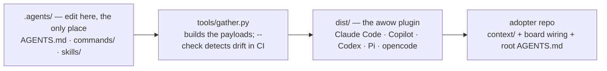

# How awow is built and shipped

One source tree becomes the plugin bundle every harness installs, and a maintainer dogfoods the
exact artifact adopters get.

> **TL;DR** — all agent instructions are authored once under `.agents/` in the awow repo;
> `tools/gather.py` builds them into the plugin payload under `dist/`, and that payload is what
> every harness installs. Nothing is mirrored into an adopter's `.claude/` or `.github/`.

**Setup is not here.** One page describes what `/setup-awow` does, asks and writes:
[SETUP.md](../SETUP.md). The command itself
([`.agents/commands/setup-awow.md`](../.agents/commands/setup-awow.md)) is the behavioural source
of truth; every page follows it.

## One source, every harness

A team using more than one coding agent hits the same problem: every instruction file, prompt,
and skill ends up duplicated per harness, someone fixes a convention in one copy and forgets the
other, and the agents follow different rules.

awow's answer is **one source, one build, one install.** Everything is authored once under
`.agents/` in the awow repo. `tools/gather.py` renders it into one self-contained plugin per harness under
`dist/<harness>/<plugin>/` — full command copies for Claude Code, the same commands repackaged
as skills for Codex, Pi and opencode, and the Copilot plugin under `dist/copilot/awow/` — and CI fails on drift with
`--check`. Adopters install that payload; their repos hold only `context/`, the board wiring,
and their own root instruction file. There is no per-repo copy of a prompt to drift.



Path tokens make this possible: prompt bodies name `{ANCHOR}`, `{PROJECT}`, `{AWOW_ROOT}` and
`{AWOW_TOOLS}` instead of literal paths, and gather substitutes the harness-correct form at build
time — `${CLAUDE_PLUGIN_ROOT}` for Claude Code, a skill-relative path for Codex and Pi — while
`{ANCHOR}` and `{PROJECT}` ship as-is; the agent fills them in at the start of each session.

## The maintainer loop

The marketplace Claude Code and Copilot install from **is** the awow repo:
`.claude-plugin/marketplace.json` serves `./dist`. So a maintainer dogfoods the exact artifact
adopters get, and a merge to `main` is what reaches their own sessions:

```bash
# after a merge to main
/plugin marketplace update awow
/plugin update awow

# exercise a branch's payload before it merges
python tools/gather.py && claude --plugin-dir dist/claude/awow

# in CI: fail if dist/ drifted from .agents/
python tools/gather.py --check
```

Copilot's equivalent is `copilot plugin marketplace add CauchyIO/awow`; Codex, Pi and opencode
install from `awow-dist`, which carries the same built payload. Nothing is generated into the
awow repo's own `.claude/` or `.github/` — the instruction files there are short hand-authored
pointers to `.agents/AGENTS.md`, and `/test-awow` (the eval runner) is the one command that
lives in `.claude/commands/` rather than the payload.

## Sources of truth

- [`.agents/commands/setup-awow.md`](../.agents/commands/setup-awow.md) — the command: the five situations, the diff and the gate
- [`README.md`](../README.md) — "Installing the plugin", "Contributing to awow"
- [`.agents/AGENTS.md`](../.agents/AGENTS.md) — the canonical rule set and the path tokens
- [`tools/gather.py`](../tools/gather.py) — the payload build and `--check` drift gate
- Companion guides: [board & MCP integration](guide-board-and-mcp.md) — what setup wires and how an MCP joins it; [updating awow](guide-update-and-versioning.md) — how a repo takes newer awow
