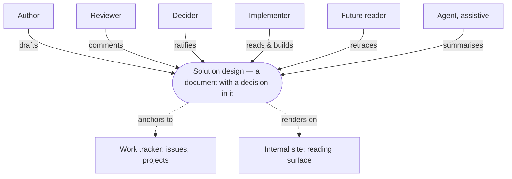
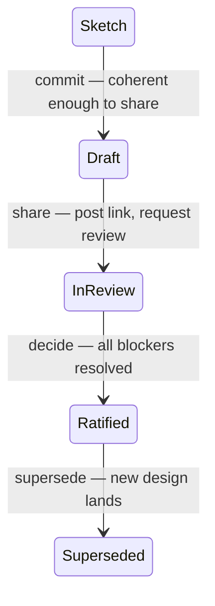
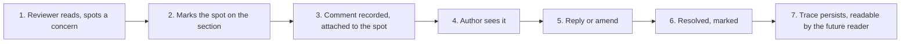
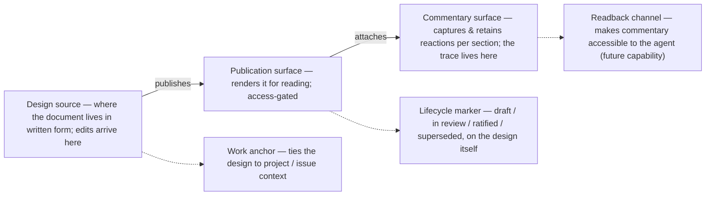

# Solution-design collaboration flow

Functional view — C1 (context) and C2 (containers). No technical implementation.

> **TL;DR** — A solution design turns an open question into a recorded decision. To work it needs
> three things: a **place** (where designs live), a **lifecycle** (when a sketch becomes ratified),
> and a **feedback channel** (how objections land back on the artifact). The last is the one
> usually broken — commentary in PRs, docs, and chat drifts away from the design, so the trace of
> who pushed back and what was decided is lost. Technologies, schemas, endpoints, and
> infrastructure are deliberately absent: agree the shape and the lifecycle before the wiring.

## Actors

Five human roles plus an assistive agent. The same person plays different roles at different
times; the roles are stable, the headcount per role is not.

| Role | What they do with a design |
| --- | --- |
| **Author** | Writes it. Owns the question. Resolves feedback before ratification. |
| **Reviewer** | Reads, challenges, comments, approves. Brings the perspective the author lacked. |
| **Decider** | Final say when reviewers disagree. Often the author, sometimes not. |
| **Implementer** | Turns the ratified design into code, config, or process. Comments post-hoc when reality bites. |
| **Future reader** | Reads it months later asking "why did we do it this way." The role most teams fail. |
| **Agent** (assistive) | Drafts, summarises feedback, surfaces inconsistencies. Reads designs *and their commentary* as context for downstream work. |

## C1 — system context

The design in the middle; people interact with it directly. The work tracker is where it anchors
to ongoing work, the internal site is where it is read. No technology named.

## Filing — where designs live

"Where do I put this document?" is easy to leave ambiguous and expensive to answer badly. One home
per category, no ambiguity; if you have to think about where something goes, amend the taxonomy,
not the document. Adapt the folder names to your repo's convention — the categories are the point.

| Category | What goes here | What does not |
| --- | --- | --- |
| **Designs** — `designs/` | Internal solution designs, working specs, documents with a decision the team intends to ratify. | Client-facing material, generated reports, informal notes. |
| **Decisions** — `architecture_decision_record/` | Ratified architectural decisions. ADRs, immutable history. | In-flight drafts — those are *Designs*. |
| **Proposals** — `proposals/` | Client-facing material: engagement briefs, solution proposals delivered as PDFs. | Internal-only thinking. Use *Designs*. |
| **Notes** — `notes/` | Meeting notes, informal docs, low-ceremony commits. | Anything with a decision to ratify. Promote to *Designs*. |
| **Generated** — `daily_digest/`, `monthly_digest/`, … | Outputs of automated processes; read-only from the team's perspective. | Hand-authored material. |

## Lifecycle — sketch to ratified

Five named states, each transition with a clear trigger. The trigger answers "when should I commit
/ share / decide."

| State | What it means in practice | Visibility |
| --- | --- | --- |
| **Sketch** | Author's thinking, not yet committed. No expectation anyone else looks. | Local only |
| **Draft** | Pushed so the author won't lose it, but not broadcast. Findable, not advertised. | Internal repo, not announced |
| **In review** | Author has explicitly invited reviewers. Comments open; author shepherds the conversation. | Announced; on the internal site |
| **Ratified** | Decider approved; outstanding feedback resolved or explicitly accepted as non-blocking. Binding for downstream work. | Internal site, prominent |
| **Superseded** | A newer design took over. Kept for history, marked with a pointer forward. | Internal site, marked stale |

Judgement on the three triggers that people get wrong:

- **Commit** the moment the sketch is coherent enough that *you yourself* would refer back to it.
  Don't wait for polish — the safety net is the point. Push at the same time; nobody sees it until
  you advertise it.
- **Share** when you have done what you can alone and need other perspectives. Posting the link
  *is* the state change.
- **Ratify** only when the decider says so in writing, on the design itself. Until then it is
  still being argued with.

## Feedback loop

How a reviewer's objection lands, gets addressed, and leaves a trace. No technology named — this
flow could be implemented several ways.

Two properties it must have to beat what most teams do today:

- **The mark stays on the spot.** A comment about §5.2 must be readable next to §5.2 forever, not
  in a chat thread or a closed PR.
- **Resolution preserves the trace.** "Resolved" hides a comment, it does not delete it. The future
  reader can expand resolved threads and see the argument.

## Forking

Two different things get called "fork"; treat them differently.

| | What it is | Pattern |
| --- | --- | --- |
| **Counter-proposal** | A fundamentally different design at the same level of detail. | A new document, linked to the original on the work tracker. Both compete for ratification; discussion happens on each, plus a meta-thread comparing them. |
| **Suggested edit** | A reviewer wants a sentence to say X instead of Y. | Stays a comment on the section. The feedback loop already handles it; a parallel design for a sentence is overkill. |

Where a counter-proposal exists, the original's threads show on it as read-only context, so the
counter-author sees what was already debated. New commentary lands on whichever document the
reviewer is reading, and the work tracker carries the relationship so neither feels orphaned.

## C2 — containers (functional)

One layer below C1: the containers the design lives in, named by *what each does*, not what it is
built with. Mapping them to specific tools is a C3 conversation.

Pick a technology before agreeing which container does what, and the technology drives the shape
rather than serving it. Articulate what each container is *for* first; only then ask which tool
plays the commentary-surface role.

## Open questions a team should answer

Deliberately not decided here — the answers shape how the C2 containers get implemented.

1. **Filing taxonomy.** Are those five categories right for you? Specifically: is "Designs" worth
   splitting from "Decisions," or are they one thing in two lifecycle states?
2. **Ratification authority.** Who declares a design ratified — always the author, always the
   Decider, or does it depend on the kind of design (security vs product vs process)?
3. **Resolved-state semantics.** Is the resolution itself recorded (who, when, why), or is
   "resolved" a binary flag with no narrative?
4. **Lifecycle and the work tracker.** Does the tracker reflect the design's state automatically,
   or is that a manual update? The latter is simpler but drifts.
5. **Scope of commentary.** Designs only, or every published document — digests, client proposals,
   ADRs? Decide per category, not per document.
6. **Future-reader trace bar.** The standard suggested here is "three years from now, the future
   reader can see who pushed back and why." Tighter is cheaper; longer costs storage and search.
7. **Bootstrap pattern.** How do in-flight designs move off ad-hoc PRs and shared docs? Lowest
   friction: keep commenting in PRs, but copy the conclusions onto the design's in-repo thread when
   it is ratified.

## Sources of truth

- [`.agents/commands/solution-design-flow.md`](../.agents/commands/solution-design-flow.md) — the command that turns a design conversation into a locked design and a decomposed work-item tree
- [`.agents/commands/project-plan.md`](../.agents/commands/project-plan.md) — what a ratified design feeds: the stated dependency graph and board items
- [`.agents/AGENTS.md`](../.agents/AGENTS.md) — the proposal-first spine these lifecycle states sit on
- Companion guides: [transcript router](guide-transcript-router.md), [core delivery loop](guide-core-delivery-loop.md), [coordinating delivery](guide-delivery-coordination.md)
