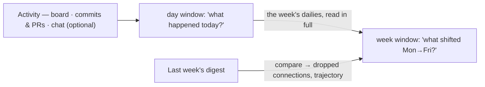

# Standardise reporting

The read-only synthesis layer: a day, then a week — each a different zoom level on the same
activity.

> **TL;DR** — The board *lists* what changed; nobody can see the shape of it. `/daily-digest`
> answers the harder question — what happened, where is it heading, what connects, and what
> should someone know that they don't. One command, two windows: a day, or `--week` for a
> Mon–Fri view that reads the dailies as input. It reads board, code, and optional chat,
> writes one markdown file, and opens a PR only after you approve. Nothing else is changed.

## When this layer makes sense

Reporting earns its keep only once there is a steady stream of activity to synthesise: at least
three delivery cycles shipped, most of the team actively committing, and Step 0 of `/setup-awow`
complete. The week window adds one prerequisite — dailies covering at least four working days of
it, because they are its richest input.

## The two zoom levels

The week is not a stack of dailies. It reuses their collection and synthesis machinery to ask
different questions.



| Window | Argument | Output | Extra prerequisite |
| --- | --- | --- | --- |
| One day | none, or `YYYY-MM-DD` | `digests/YYYY-MM-DD.md` | — |
| Mon–Fri | `--week`, or `YYYY-Www` | `digests/weekly/YYYY-Www.md` | dailies for ≥4 working days |

The resolved window is stated back to you in one line before any collection, so a misparsed
argument is caught early. Department-level cross-team visibility is handled by `/okr-cascade`,
not by these digests. The old cross-team command was folded into it.

## Synthesis, not aggregation

Re-listing what the board already lists adds nothing. The job is four questions:

- **What actually happened?** A narrative, not bullets.
- **What's the trajectory?** Which projects are moving, stalling, or blocked.
- **What connects?** Work by one person that bears on another's — dependencies and overlaps
  nobody tracked formally.
- **What should someone know that they don't?** Cross-relevance the board never surfaces.

The digest names something specific or says nothing at all. *"A's rate-limit work could inform
B's gateway redesign"* is useful; *"everyone should stay aligned"* is noise. Per-person sections
follow the same rule — an empty section is fine; the digest won't invent relevance to fill one.

The day's file always has the same shape: data sources and their status, a day-at-a-glance metric
table, a 6–12 sentence team narrative, a per-project snapshot (today · trajectory · key signal),
cross-team connections, code activity, per-person takeaways, and structural observations.

## The pipeline

```
Phase 0 ─ Window & reuse check
Phase 1 ─ Data collection      (board + code + optional chat)
Phase 2 ─ Synthesis            (the four questions)
Phase 3 ─ Write                → digests/…
Phase 4 ─ Review gate          — mandatory: "ship" · "edit <what>" · "stop"
Phase 5 ─ Open the PR          — only after "ship"
```

### What it collects

| Source | What comes back, and the catch |
| --- | --- |
| Board | Every issue touched in the window: who, what changed, which project. A private source (e.g. a leadership-only board) is read to inform per-person sections but **excluded from anything shared**. |
| Code | Commits, PRs, reviews, mapped back to issues where a branch or message names one. If a repo has commits but no matching ticket, the digest flags that as a gap. |
| Chat (optional) | Channel messages only, where a channel→project mapping exists. **Meeting transcripts are always excluded** — they carry personal data and belong to `/process-transcript`. |

An empty result on a day you know was busy is treated as a probable query fault — wrong team name,
stale credentials — not as truth. `skip chat` and `skip code` are honoured; the digest is built
from whatever data came back.

### What the week window adds

The week asks its own questions: what actually *moved* (outcomes, not activity), what shifted
Monday→Friday, where the team spent its time, and what patterns are emerging. Three inputs feed
them:

- **The week's dailies**, read in full — already-synthesised narratives, snapshots, connections.
  If a daily is missing, the weekly says so rather than quietly leaving the day out.
- **Last week's digest**, if `digests/weekly/YYYY-W(ww-1).md` exists — to detect **dropped**
  connections and compare trajectories. If it doesn't exist, the digest says so once and drops
  that subsection.
- **Weekly figures:** weekly counts (created, completed, stale, active projects, PRs merged);
  collaborations classified **active** (3+ days), **emerging** (first this week), or **dropped**
  (active last week, absent now); a project trajectory report (Monday vs Friday plus direction); a
  team activity heatmap of relative effort; and a personalised week-in-review.

### The gate and the PR

Phase 4 is mandatory and never skipped: you get the file path, the window, the item count, the
sources and their status, and any coverage gaps, then choose. On `ship` it branches
(`digest/YYYY-MM-DD` or `digest/YYYY-Www`), commits **only** the digest file, and opens the PR with
the narrative as the body. If there's no remote or no `gh`, it doesn't fail quietly — it commits
on the branch and tells you the literal command to finish it.

Afterwards it offers `/kb-mine` over the same data once; decline and it won't ask again.

## Boundaries that always hold

- **Read-only against every source.** The only writes are the digest file and its branch.
- **Data-grounded.** It only cites board IDs it actually saw during collection, and never invents
  counts. The wider week window makes invention easier and harder to spot.
- **Never evaluative.** No individual performance assessment, no strategic recommendations —
  it surfaces connections and leaves the judgement to you.
- **Private stays private.** Private-team detail never reaches a shared digest.
- **No HTML.** This produces markdown. A styled standalone digest is `/artifact`'s job — it owns
  the house style and reads the design system.

## Sources of truth

- [`.agents/commands/daily-digest.md`](../.agents/commands/daily-digest.md) — both windows: the six phases, the collection surfaces, the review gate, and the behavioural boundaries
- [`.agents/commands/okr-cascade.md`](../.agents/commands/okr-cascade.md) — the department altitude that replaced the retired cross-team stub
- [`.agents/commands/kb-mine.md`](../.agents/commands/kb-mine.md) — the deep lens over the same snapshot, offered at hand-off
- Companion guides: [session correlation](guide-session-correlation.md) — the join that lets a digest name the session behind an item; [trace analysis](guide-trace-analysis.md) — the read side over the same sessions; [design systems & HTML artifacts](guide-design-system-and-artifacts.md) — where a styled digest gets its house style
