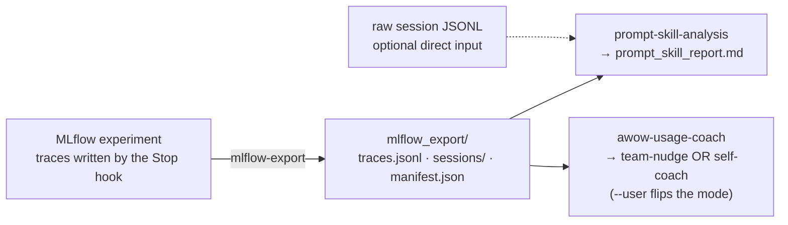

# Trace analysis

What you do with the sessions once they exist: export, then assess.

> **TL;DR** — One skill **pulls** traces down to local JSON (`mlflow-export`); two skills **read**
> that JSON into markdown reports — `prompt-skill-analysis` (how well someone prompts) and
> `awow-usage-coach` (how a team or person works, and what to change). The scripts only count and
> extract — the interpretation is done by the model reading the output. All three need the traces
> to already exist — the MLflow Stop hook records them, set up via `claudetracing` — and all three
> ship in `awow-telemetry` (`/plugin install awow-telemetry@awow`), Claude Code only; Codex and Pi
> users get the core awow plugin only (no telemetry skills).

## The pipeline



| Skill | In | Out |
| --- | --- | --- |
| **`mlflow-export`** — paginates the experiment and writes every trace (info, request, response, spans) plus a per-session grouping | Experiment id or URL + Databricks profile | `traces.jsonl`, `sessions/<id>.json`, `manifest.json` |
| **`prompt-skill-analysis`** — an evidence-backed read on clarity, specificity, structure, iteration, and voice, with concrete suggestions | An `mlflow_export/` dir *or* a raw session JSONL; auto-detects single vs. multi-session | `prompt_skill_report.md` |
| **`awow-usage-coach`** — reads sessions through three lenses and reports in one of two modes | An `mlflow_export/` dir; `--user` sets the subject | A `team-nudge` or `self-coach` report |

## How `awow-usage-coach` reads a session

It is vocabulary-agnostic on purpose — it measures behaviour, not labels, so it works whether or
not a team uses awow's slash commands. Three lenses, in priority order:

| Lens | What it measures |
| --- | --- |
| **Intent shape** | Every prompt is classified into one of the eight intent labels (else `other`) — see [prompt taxonomy](guide-prompt-taxonomy.md). |
| **Sequence patterns** | Runs of two or three intents in a row (e.g. *explore → propose → implement*) show the working rhythm. In self-coach mode, subject vs. team rhythms are compared. |
| **Edit patterns** | Each trace's `files.modified` is bucketed by type (proposal, context, agents-config, code, markdown…) and crossed with intent — e.g. *"when teammates 'propose', 70% of touched files are .md; when you 'propose', 50% are code."* |

Without `--user` it runs **team-nudge**: it finds habits recurring across the team and drafts
rules to add to `.agents/AGENTS.md` / copilot-instructions. With `--user` it runs **self-coach**:
direct, encouraging coaching for one developer, measured against the team average.

## Running the pipeline

In practice you invoke the skills by name (`/mlflow-export`, `/prompt-skill-analysis`,
`/awow-usage-coach`) and the agent runs the extractor, then writes the qualitative report. This is
what runs underneath:

```bash
# 1. pull the traces down to JSON
.venv/bin/python .agents/skills/mlflow-export/scripts/mlflow_export.py \
    --experiment-id <ID> --profile <PROFILE> --out ./mlflow_export

# 2a. prompt-quality report (export dir OR a raw session JSONL)
python3 .agents/skills/prompt-skill-analysis/scripts/extract_prompts.py \
    --input ./mlflow_export --out ./analysis.json
#     then the agent reads analysis.json and writes the markdown report

# 2b. usage coaching — omit --user for team-nudge, add it for self-coach
python3 .agents/skills/awow-usage-coach/scripts/awow_extract.py \
    --input ./mlflow_export --out /tmp/awow_usage.json [--user <email>]
```

## Backend & harness portability

These ship as starters for **Databricks MLflow** + **Claude Code**. The analysis rubrics are
harness-agnostic — only the input parsing assumes MLflow's JSON layout. A team on another backend
either emits the same layout `mlflow-export` produces, or extends the extractor scripts
(`extract_prompts.py`, `awow_extract.py`) with a reader for their format. That customisation is
what `/setup-awow` Step 9 (Skills review) is for.

## Sources of truth

- [`.agents/skills/mlflow-export/SKILL.md`](../.agents/skills/mlflow-export/SKILL.md) — the export contract and the JSON layout everything downstream reads
- [`.agents/skills/prompt-skill-analysis/SKILL.md`](../.agents/skills/prompt-skill-analysis/SKILL.md) — the prompt-quality rubric and report shape
- [`.agents/skills/awow-usage-coach/SKILL.md`](../.agents/skills/awow-usage-coach/SKILL.md) — the three lenses, the intent taxonomy, and the two modes
- Companion guides: [session correlation](guide-session-correlation.md) — the write side, how a board entry names its session; [session timeline](guide-session-timeline.md) — the visual read of the same data
