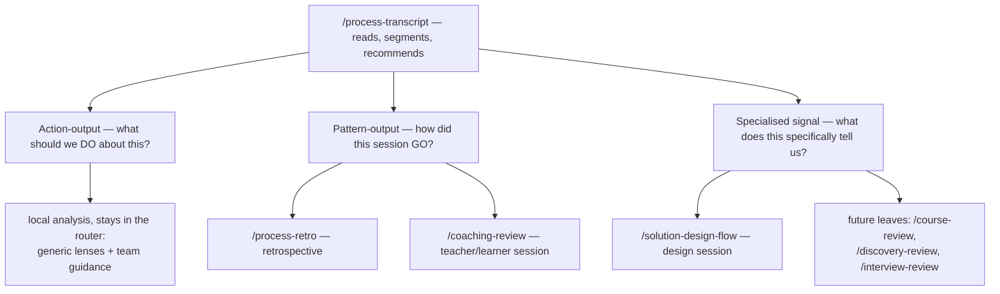
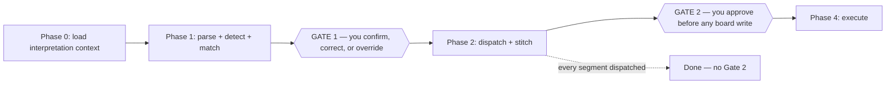

# Transcript router

One entry point: the router reads the transcript, recommends a specialist, and walks you through
two approval checkpoints — meeting to board in minutes.

> **TL;DR** — `/process-transcript` is the only command you type. It reads the transcript, names
> the meeting types it recognises in each segment (see the meeting-lenses section below), adds
> your team's own notes on that meeting type (if you've written any), recommends specialists
> with a rationale, and stops at Gate 1. Matched segments are dispatched to their specialist;
> the rest are analysed in place, using the matched lenses together, before any board write.

## The shape — one entry, many specialists

The more specialists a team adopts, the harder it gets to remember which to type, so the router
works it out from the session itself.



Two rules hold it up:

- **Honest routing.** The top line of every run says what was detected and what was recommended.
  If it dispatched silently, you'd have no way to tell why it chose that specialist.
- **Always overridable.** `--as=<skill>` forces a specialist and skips detection entirely; `--yes`
  skips the dispatch gate when you already trust the call.

## Set up the repo — once

Skip this if the repo was bootstrapped with `/setup-awow`.

1. **The prompt is present** — `/process-transcript` under `.agents/commands/`, copied into both
   harness directories (`.claude/`, `.github/`) by `tools/gather.py`.
2. **A folder to drop `.vtt` files in** — e.g. `.github/transcripts/`.
3. **Keep it out of git.** Transcripts may carry personal data, so add the folder to `.gitignore`.
   The trace pipeline records the *path* to a transcript, never its contents.

```bash
# .gitignore — add at the bottom
.github/transcripts/
```

## Get the transcript

**Prefer WebVTT** (`.vtt`): it keeps speaker tags (`<v Speaker Name>`) and timestamps, which drive
attribution, segment boundaries, and ordering. Plain text, Markdown, and `.srt` also work. From
Teams: open the meeting, **Transcript** tab, **Download → .vtt**.

**On a Cloud PC:** if your editor runs on a Cloud PC but the recording downloads to your laptop,
copy the VTT across (OneDrive, email-to-self, or clipboard paste) before you point the prompt at it.

Name the file descriptively — `refinement-payments-rewrite.vtt` beats `meeting1.vtt`; the filename
is a classification hint. Paste an agenda alongside it and the router notes which items the meeting
actually covered. It never fetches transcripts or agendas for you.

## Interpretation first, output configuration later

Before reading the transcript, the router loads a small interpretation pack. These files shape its attention, vocabulary, attribution, and understanding of team boundaries:

| Preloaded context | What it shapes |
| --- | --- |
| `context/team/mission.md` | Relevance, scope, and the team's purpose. |
| `context/team/members.md` | Speaker identity, role, responsibilities, and focus. |
| `context/knowledge-base/glossary.md` | Domain vocabulary and transcription correction. |
| `context/team/meetings/*.md` | How your version of a standard meeting differs, plus any meeting type unique to your team. |
| `context/company/neighbouring-teams.md` | Team names, ownership boundaries, and likely dependencies. |

The router only loads output config when it needs it: `board.md` when it starts matching against
the board, conventions and `board-output.md` (via `workitem-write`) just before Gate 2, and
knowledge-base routing only if it's proposing a KB entry. If every segment goes to a specialist,
none of these are read at all.

The router flags missing or out-of-date interpretation context at Gate 1, but only when it would
actually change the result.

## The run — two gates you control

Open a fresh session and point the command at your file.

```bash
/process-transcript .github/transcripts/your-meeting.vtt
```



Phases 3 and 4 (board discovery, then execution) run only for segments the router analyses itself.

### Gate 1 — detected & recommended

```
GATE 1 — DETECTED & RECOMMENDED

Detected 2 segment(s):
  00:00–00:32  generic: retrospective, ad-hoc (confidence: clear, likely)
                 team guidance: retrospective.md
  00:32–01:01  generic: architecture discovery (confidence: likely)
                 team guidance: none

Recommended dispatch:
  /process-retro          on segment 1  — looking-back framing, peer dynamic
  /solution-design-flow   on segment 2  — options weighed, architecture decided

Duration: ~61 min | Participants: Alex, Sam, Pat, …
Disambiguation: "S-D-W" → SDW (glossary); "Sam" turn at 00:14 likely Pat
```

Check four things: segment classification, participant names, *decided* separated from *merely
explored*, and whether garbled words and mis-attributions were corrected sensibly. Correct it in
plain language — *"the person labelled Sam around 00:14 is actually Pat; on segment 2 we landed on
option B, not A"* — then reply `go`, `--as=<skill>` to override a segment, or `local` to skip
specialist dispatch. The router asks at most two clarifying questions, and only when a wrong answer
would change a board write.

### Gate 2 — board actions, or a proposal

Dispatched segments run their own pipelines and do their own board writes; the results are
stitched into one composite report. Gate 2 fires only for segments analysed locally; for those
the router does board discovery — matching existing items, detecting cross-team blockers,
spotting gaps:

```
GATE 2 — PROPOSED ACTIONS

Board mapping: 2 matched | 1 new | 1 cross-team dep | 0 untracked

Actions:
  UPDATE  1. #482 — add refinement outcome, move to Ready
  CREATE  1. Story "Add idempotency key to payment retry"
  ESCALATE 1. blocked by Platform #91 → cross-team sync
  KB       1. decisions/payment-retry.md — chose at-least-once + dedupe

Options: "go" · "skip 2,3" · "review" · "cancel"
```

Two ways to go from here. **Execute** — reply `go` and items are created or updated one at a
time; `skip` and `review` to be selective. **Capture to a proposal** — *"don't touch the board,
drop it all in `proposals/<topic>.md`"* — for a project still in discovery, requirements not yet
validated with business users, or when you want to accumulate several meetings before the board
exists. Nothing is written without approval at this gate.

## After the gates — enrich the output

The agent still has the full meeting loaded. All optional:

- *"Add clarifying questions at the bottom — what's still missing to execute this in its
  entirety?"* → a list of unknowns, and prep for your next meeting.
- *"Tomorrow I'm meeting the business. Help me prepare a questionnaire."* → 20–30 targeted
  questions to bring to stakeholders.
- *"Create an architectural diagram of the data flows we discussed, then wireframes for the UI."*
  → Mermaid or ASCII diagrams. With a design system wired up, styled HTML artefacts adopt its
  tokens — see [Design systems & HTML artifacts](guide-design-system-and-artifacts.md).

Dictate your answers to that questionnaire and process *that* as a transcript too.

## Iterate across meetings

Next meeting, open a fresh session and point the router at *both* the new transcript and the
proposal you saved last time:

```bash
/process-transcript .github/transcripts/new-meeting.vtt
# Also attach: proposals/<topic>.md (from the previous session)
```

The router intersects prior context with the new conversation — updating decisions, resolving open
questions, adding requirements, flagging contradictions. Meeting 1 → proposal v1; meeting 2 + v1 →
v2; meeting 3 + v2 → v3 → board items.

Once items exist, open one agent session per item and let each pick up its work through
[`/process-workitem`](guide-core-delivery-loop.md); the board stays current as they go.

## Variants live inside a specialist, not beside it

Some session types have variants that share a pattern library. `/coaching-review` handles both 1:1
coaching (pairing, demo, onboarding) and 1:many teaching (course, lecture, cohort): same
teacher/learner dynamic, slightly different patterns to watch. The shared core stays in one place
and adopters learn one skill instead of five — the variant is detected, not declared. Rule of
thumb: add a variant to an existing specialist first; split out a new one only when the two stop
sharing most of their logic.

## Adding a new specialist

Five artefacts per leaf. The filesystem *is* the registry — the router globs commands at runtime
and matches segments against frontmatter, so there is no central registry file to keep in sync.

| Artefact | Where | Purpose |
| --- | --- | --- |
| `<skill>.md` | `.agents/commands/` | The full prompt (flat; phase lives in frontmatter) |
| Mirror files | `.claude/commands/`, `.github/prompts/` | Auto-generated by `tools/gather.py` |
| Grounding context | `context/<domain>/` | Reference material and known pitfalls, read on demand by whichever command needs it |
| Guide | `guides/guide-<workflow>.md` | Onboarding for first-time adopters |
| `consumes: transcript` + `when-to-use` / `when-not-to-use` | frontmatter of `<skill>.md` | What the router matches segments against at runtime |

Once the new command file is in place, run `python tools/gather.py` to refresh the mirrors, then
list the new command in [`.agents/commands/README.md`](../.agents/commands/README.md).

## Teaching the router about meetings

Generic meeting lenses (the *archetypes* in the directory name) live under
[`.agents/commands/_meeting-archetypes/`](../.agents/commands/_meeting-archetypes/README.md).
They describe how to recognise a meeting shape, what to extract, what may be missing, and common
interpretation mistakes. A segment can use several lenses at once.

Don't fork a generic lens — your copy stops getting updates. Instead, add a small plain-Markdown
file under `context/team/meetings/`, and only when the team's ritual meaningfully differs. Name a
familiar ritual after the generic kind, or describe a custom meeting with `How to recognise it`,
`What matters in this meeting`, and `What useful output looks like`. The team can edit these
files directly or let `/setup-awow` draft them; no file means the generic behaviour already fits.

## Sources of truth

- [`.agents/commands/process-transcript.md`](../.agents/commands/process-transcript.md) — the pipeline, the two gates, and the detection rules
- [`.agents/commands/coaching-review.md`](../.agents/commands/coaching-review.md) — the sub-mode leaf and its pattern library
- [`.agents/commands/solution-design-flow.md`](../.agents/commands/solution-design-flow.md), [`.agents/commands/process-retro.md`](../.agents/commands/process-retro.md) — the other transcript-consuming leaves
- [`.agents/commands/README.md`](../.agents/commands/README.md) — the full command catalogue this guide deliberately is not
- `context/tooling/board.md` — the board integration Gate 2 writes through; written by `/setup-awow`
- Companion guides: [agentic retro workflow](guide-agentic-retro-workflow.md) — the retro specialist this dispatches to; [solution-design collaboration](guide-solution-design-collaboration.md) — the design specialist this dispatches to; [core delivery loop](guide-core-delivery-loop.md) — where the items it files get worked
