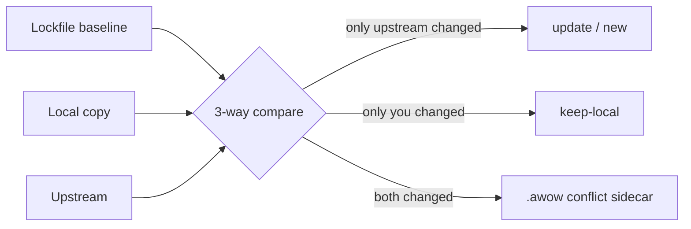

# Updating awow

Pull newer awow into a repo that is already set up — without losing anything your team owns.

> **TL;DR** — `/setup-awow` configures a repo once; `/update-awow` keeps the scaffolding current
> afterwards. Your job is two actions: invoke it, and approve or reject the plan it shows. Under
> the hood `tools/awow_lock.py` does a 3-way compare per file — lockfile baseline vs your local
> copy vs upstream — and only starter-owned paths are ever managed. Conflicts are never merged
> for you: upstream lands beside your file as `<file>.awow`. Nothing is written before you
> approve, and git is the backstop.

## How the update decides what to touch

The lockfile — `tools/awow.lock.json` — records a hash of every starter-owned file as you last
reconciled it. An update is a 3-way compare per file: baseline, local, upstream.



| Verdict | Meaning | What happens |
| --- | --- | --- |
| **update** | Upstream changed; you didn't | Overwritten with the new version |
| **new** | Upstream added a file | Created |
| **keep-local** | You edited; upstream didn't | Left alone — your edit wins |
| **conflict** | Both changed | Your file untouched; upstream saved beside it as `<file>.awow` to merge |
| **removed-local** | You deleted it | Not re-added |
| **removed-upstream** | Upstream deleted it | Your copy left alone (delete by hand if you want to follow) |

Only **starter-owned paths** are managed: `.agents/`, `tools/`, `setup/`, `context/` reference
material, `mcps/`, `pyproject.toml`, `SETUP.md`, `REFERENCES.md`. Team-owned content —
`context/team/`, `context/company/`, `board.md`, `setup-progress.md`, a bootstrapped
`AGENTS.md`, everything under `proposals/` — is never rewritten by an update.

## The human flow — two actions

With the awow plugin installed:

```bash
/plugin update awow     # refresh the bundle (Copilot CLI: copilot plugin update awow)
/update-awow            # agent shows the plan; you approve or reject
```

Without the plugin, point at a checkout: `/update-awow --source ../awow`. The agent pulls the
source current, verifies it is clean, and takes it from there. Either way it presents a grouped
plan — what updates, what is new, what conflicts — and **writes nothing until you approve**.
After apply it re-mirrors the harness stubs (`tools/gather.py`) and reports the version delta
plus any `.awow` conflict files left to merge.

Run it on a branch and read the `git diff` as your final review — git is the backstop, so
nothing an update does is unrecoverable. Add `--check` to see the plan and stop: a zero-risk way
to ask "how far behind are we?".

## First run in an older repo

A repo set up before the update machinery existed has no lockfile and no `tools/awow_lock.py`.
You prepare nothing: the agent self-bootstraps — copies the tool from the source, then seeds the
lockfile from your current tree (`backfill`, which establishes "you are here" and changes no
other file). Your flow is still invoke → approve.

**The one first-run caveat.** A freshly seeded baseline equals your local state, so the first
compare cannot distinguish "we edited this" from "upstream moved" — files your team deliberately
changed show up as *update (will overwrite)* instead of *conflict*. The agent is instructed to
walk that list against your known customisations and flag high-risk entries (a real product
`pyproject.toml`; reference `context/` you filled in) before you approve. Review that first plan
more carefully than usual; from the second update on, the lockfile holds a true reconciliation
point and your edits classify as *keep-local* automatically.

## Merging a conflict

A conflict never touches your file. The upstream version lands next to it as `<file>.awow`; you
diff the two, take what you want, and delete the sidecar. The update is not done until every
`.awow` is gone — the report lists them so none are forgotten.

```bash
diff .agents/commands/daily-digest.md .agents/commands/daily-digest.md.awow
# merge what you want, then:
rm .agents/commands/daily-digest.md.awow
```

## What the version numbers mean

| Where | What it is |
| --- | --- |
| `.claude-plugin/plugin.json` → `version` | The canonical awow version. Bumped when starter-owned files change; the plugin marketplace serves it and `status` reports it as the "to" side. |
| `tools/awow.lock.json` → `awow_version` | The version *your repo* last reconciled against — the "from" side of every plan. |
| Git tags (`v0.4.0`, …) | Pinnable release points on the awow repo. Pass a tag checkout as `--source` to update to a specific version instead of whatever `main` is. |

Correctness never depends on the numbers — the compare is content-hash based — but the numbers
carry the meaning: a plan that says `0.3.0 → 0.4.0` tells you you're taking a real release, and a
repo whose lockfile says `0.4.0` is verifiably current. Maintainers: bump the version in the same
change that alters starter files, and tag the release commit.

## Sources of truth

- [`.agents/commands/update-awow.md`](../.agents/commands/update-awow.md) — the flow and its approval gate
- [`tools/awow_lock.py`](../tools/awow_lock.py) — the 3-way compare and lockfile format
- [`.claude-plugin/plugin.json`](../.claude-plugin/plugin.json) — the canonical version
- Setup counterpart: [Setup & the pointer-stub model](guide-setup-and-two-harnesses.md)
